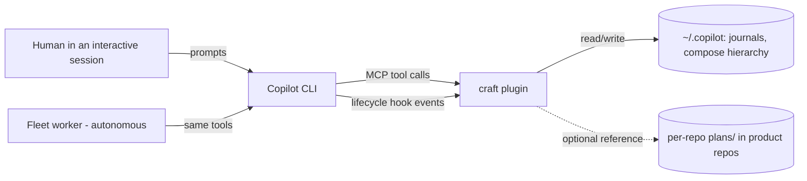
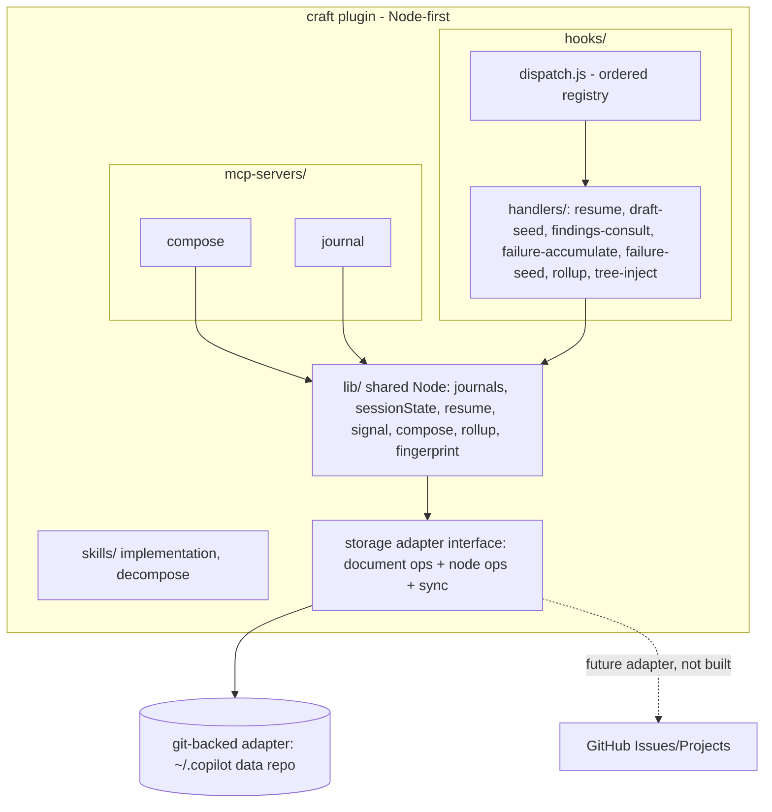
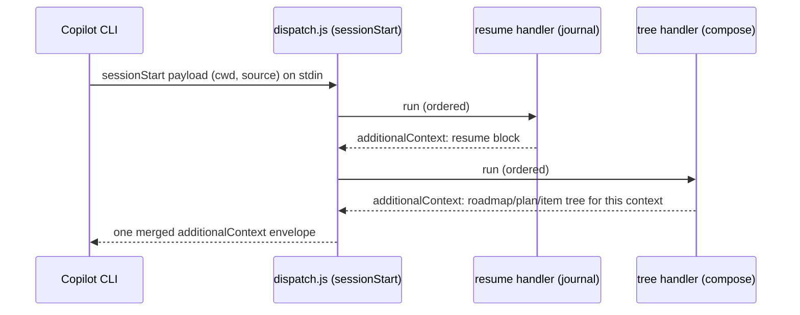
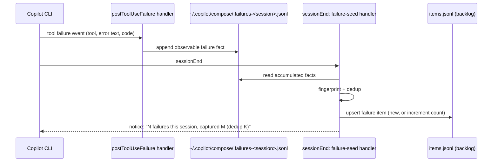
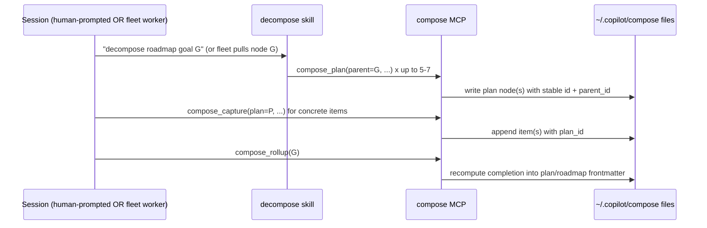

# Design 0001: craft foundation + session-driven work composition

Status: implemented (2026-06-16)
Author: Caleb Blake

## Implementation status

Tracked against the design slices (each slice is test-gated and shippable):

| Slice | Covers | Status |
|---|---|---|
| 1 | Storage adapter (D2 data layer) + a proving consumer | built |
| 2 | Journal ported onto the adapter (D5): data libs, MCP server, hook CLIs | built |
| 3 | Node hook dispatcher with an explicit ordered registry (D1) | built |
| 4 | Git-backed session-boundary sync at the adapter (D2 sync) | built |
| 5 | Compose MCP + node-ops + deterministic roll-up (D3, D4) | built |
| 6 | Trigger-based failure capture (D6) | built |
| 7 | Tree view (compose_tree tool + sessionStart work-tree injection) | built |
| 8 | Decompose discipline skill (D7) | built |

All eight slices are realized: D1-D6 in code, the tree view in code + injection, and the D7 decompose skill in `plugins/craft/skills/decompose/`. The journal's on-disk format is preserved; the adapter owns where files live and (when a remote is configured) syncs them across machines via session-boundary git. This design is fully implemented.

## Context and scope

craft is today a skill-only Copilot CLI plugin: one skill (`implementation`), a marketplace manifest, and one test. This spec turns craft into the production home for session-driven engineering tooling and designs the first system to live there beyond skills: a top-down work-composition hierarchy (roadmap to plan to item) with reliable failure capture. It also covers porting the already-validated journal (resume continuity + findings reuse) out of copilot-tools.

Two forces drive this now. First, the journal and the new work-composition system both need plugin substrate (an MCP host and lifecycle hooks) that craft does not yet have. Second, a clarify-intent pass established that the real goal is the composition hierarchy driven by sessions, not a better backlog tool; the backlog is the leaf layer.

Background, linked not dumped: copilot-tools is the proving ground (the journal shipped there as PR #553 and is validated at 187/187 tests). The prior-art research behind the data-model and failure-capture choices is summarized in this spec's decisions; the full report lives with the planning notes.

## Goals

- Establish craft's plugin substrate: an MCP host, a lifecycle-hook dispatcher, and a test harness. Node-first and host-agnostic.
- Port the validated journal (libs + hooks + tests) to craft with no data migration (journals stay per-host under `~/.copilot/journals/`).
- Design the roadmap to plan to item data model: three levels, stable IDs, frontmatter links, deterministic script-computed roll-up.
- Reliable failure capture: trigger-based, fact-grounded, deduplicated, captured into the item layer automatically (not dependent on the agent choosing to remember).
- Every operation is session-driven in two modes: prompted (a human asks an interactive session) and auto (a fleet worker). The same operation must work in both.
- Cross-machine persistence: the data syncs across the developer's machines. The storage layer is swappable behind a port, so a multi-user backend can replace it later without rewriting the model or tools.

## Non-goals

- Full fleet dispatch-at-any-level is not built here (it is a later phase, and it is a cross-repo dependency since the fleet lives in copilot-tools).
- No GUI or web view. The surface is session-facing: MCP tools, hooks, a skill, and markdown the agent reads and writes.
- No parallel-DAG decomposition. Start with linear decomposition; the research shows DAG dispatch is benchmark-proven but production-unclear.
- No lesson capture. Lessons belong to the journal, which already auto-surfaces them. This system is for work (roadmap/plan/item) and failures.
- The journal is not removed from copilot-tools in this spec. Migration is phased (see Open questions).
- Not building a multi-user collaboration backend now. The model and tool surface are kept portable so a multi-user backend (e.g. GitHub Issues/Projects) can replace the storage adapter later, but that adapter is not built here.

## Architecture

craft becomes a Node-first plugin: the MCP servers, the hook handlers, and the shared logic are all Node with zero npm dependencies. The plugin holds the code; the live data (journals, the compose hierarchy) stays per-host under `~/.copilot/`, consistent with how journals and the backlog already work.

### System context

The two callers (a human-driven interactive session and an autonomous fleet worker) reach the same craft surface. That is the load-bearing principle: operations are mode-agnostic.

### Component view

The shared `lib/` is the spine: both the MCP servers and the hook handlers call the same functions, so the structured operations (create node, link, roll-up, fingerprint a failure) have one tested implementation. This is the pattern the journal rewrite already proved (resume.js reused by the MCP and the hook). Below `lib/` sits a single storage **adapter** that is the data layer for *both* MCPs (journal and compose) and every hook. Nothing above it touches the filesystem directly; it owns persistence + cross-machine sync for all per-host data (journals, the compose hierarchy, the backlog, signals). The git-backed file adapter implements it today; a multi-user adapter (GitHub Issues/Projects for the node-shaped compose data) can replace it later without touching the layers above (D2).

## Key flows

### Flow 1: session start (merged resume + tree injection)

The dispatcher runs registered sessionStart handlers in an explicit order and merges their `additionalContext` into one envelope. This is the copilot-tools dispatcher behavior, reimplemented with an explicit registry instead of header-comment scraping (see Decision 1).

### Flow 2: failure capture (auto, fact-grounded)

Capture is grounded in observable facts (the actual error text, exit code, tool name) accumulated during the session, not an end-of-session LLM judgment about whether things went well. The agent does not have to remember to capture; the hook does it. The end-of-session notice is the nudge layer on top of the automatic capture.

### Flow 3: session-driven decompose (both modes)

The decomposition discipline (at most 5 to 7 children per pass, three levels maximum) lives in the skill, so an interactive agent and a fleet worker decompose the same way. The MCP enforces the structure (stable IDs, valid parent links); the skill enforces the judgment.

## Tool and hook catalog (sketch)

Design-review fidelity: names and one-line intent, not schemas.

Compose MCP tools (small by design, reusing the backlog's proven append-only + ULID + validation patterns):

| Tool | Intent |
|---|---|
| `compose_capture` | Append a work item (today's `backlog_add`), optionally linked to a plan. |
| `compose_plan` | Create or update a plan node under a roadmap goal. |
| `compose_roadmap` | Create or update a roadmap goal (narrative outcome). |
| `compose_link` | Link item to plan or plan to roadmap (revives the dead `promote_to_plan`). |
| `compose_status` | Append a status change to any node (today's `backlog_update_status`). |
| `compose_tree` | Render the roadmap to plan to item tree (the unified view, on demand). |
| `compose_rollup` | Recompute completion from child states into parent frontmatter. |

Lifecycle hooks (Node handlers run by the dispatcher):

| Hook (event) | Intent |
|---|---|
| `resume` (sessionStart) | Journal resume block (ported). |
| `tree-inject` (sessionStart) | Surface the relevant roadmap/plan/item tree (extends the parking-lot proto-view). |
| `findings-consult` (postToolUse) | Journal consult signal (ported). |
| `failure-accumulate` (postToolUseFailure) | Append observable tool-failure facts for this session. |
| `draft-seed` (sessionEnd) | Journal draft-finding seeder (ported). |
| `failure-seed` (sessionEnd) | Fingerprint + dedup accumulated failures into items; emit the nudge. |
| `rollup` (sessionEnd) | Recompute completion for nodes touched this session. |

## Key decisions and trade-offs

### D1. Node-first hook dispatcher with an explicit registry (not the PowerShell dispatcher, not per-hook scripts)

Chosen: a small Node dispatcher (`dispatch.js`) that reads the payload from stdin, runs the handlers registered for that event in an explicit declared order, and merges their `additionalContext`. Handlers are Node modules. Registration is an explicit ordered list, not header-comment scraping with numeric orders.

Why: craft is meant to be clean and host-agnostic, and its MCP servers are already Node. Making hooks Node too means the journal's logic ports verbatim and the thin PowerShell shim layer disappears entirely (the shims only ever invoked Node CLIs). An explicit ordered registry removes the exact footgun that bit the journal rewrite twice: copilot-tools derives order from a `@dispatcher-order: N` comment and silently drops a module when two share a number.

Cost: the journal's three PowerShell hook modules get rewritten as Node handlers (small; they are thin shims today). craft must verify Node is invocable from `hooks.json` on its target hosts (it is; the hook command can call `node`).

### D2. Code and data are separate; the data is a private git-backed store behind a swappable storage port

Chosen: the roadmap/plan/item data lives in a dedicated private git repo (a data dir under `~/.copilot/`, provisionally `~/.copilot/compose/`), separate from craft's code. It syncs at session boundaries: pull-rebase at session start; commit + best-effort push at session end (one fetch/merge/push retry, else a `.pending-push` marker reconciled on the next start); a singleton lock serializes concurrent fleet git operations. The append-only JSONL uses git `merge=union` (ULID-replay resolution makes line order irrelevant, so union is loss-free); mutable plan/roadmap frontmatter uses last-writer-wins or agent-resolved conflict markers. Crucially, this is a single storage **adapter** that is the data layer for **both MCPs** (journal and compose) and every hook: they address data through the adapter (documents by logical key; nodes by ULID + parent_id), never the filesystem directly. The git-backed files are one adapter behind that interface; sync is solved once, at the adapter, for journals + compose + backlog together.

Why: git-backed session-boundary sync is the proven fit for a single-user, low-concurrency, append-heavy, small store. Real systems do exactly this (gstack, mulch, the Obsidian Git plugin), and it adds versioning + roll-up history for free. The storage port keeps the model and tool surface portable: a future multi-user backend whose primitives map to the three-level model (GitHub Issues/Projects sub-issues) can replace the adapter without rewriting the tools, hooks, or model. Research backs both the sync mechanics and the multi-user mapping.

Cost: a storage abstraction is more upfront design than direct file writes, and it must not leak git-specific semantics (merge mechanics stay inside the adapter). Git sync has known failure modes (undetected push failure, concurrent fleet git ops, stale `index.lock`) the sync layer must handle (markers, PID-checked lock cleanup). It diverges from copilot-tools' git-tracked per-repo `plans/<period>/` (those become legacy/importable). The same data repo can also hold the backlog and journals (all per-host personal state); whether journals join immediately or later is a migration detail.

### D3. Three levels, stable ULIDs, frontmatter links, deterministic roll-up

Chosen: roadmap to plan to item, three levels maximum. Every node has a stable ULID. Items live in `items.jsonl` (today's backlog, plus a `plan_id`); plans and roadmaps are markdown files with YAML frontmatter (`id`, `parent_id`, `status`, `completion_pct`) plus prose. Roll-up counts child statuses into the parent's `completion_pct`. Roadmap health is a narrative note, never a computed number.

Why: this is the battle-tested shape across Jira, Linear, org-mode, Obsidian, and Taskwarrior. Stable IDs as the link primitive survive renames; file paths do not. Deterministic count-based roll-up is simple and trustworthy. Computed roadmap health drifts from reality (Linear's explicit lesson), so the top level stays narrative.

Cost: frontmatter and links can rot if edited by hand; the MCP tools (not hand-editing) are the intended write path, and a link-integrity check is needed. Items in JSONL and plans in markdown means two storage shapes (justified: items are terse and append-only; plans carry prose).

### D4. A small compose MCP plus files, not files-only and not a large toolset

Chosen: a compact MCP (about seven tools) for the structured, validated operations (create node, link, status, tree, roll-up), backed by markdown + JSONL files whose prose the agent edits directly.

Why: the structure (IDs, links, status, roll-up) needs validation and atomicity, which an MCP gives (the backlog MCP proved this with 407 real adds and PII validation). The content (a plan's prose) is just markdown the agent edits. Keeping the toolset small avoids the dead-tool trap this session already documented twice (plan-mcp is dead at 7 calls; the journal's value was its hooks, not its tools). The auto-surfacing value lives in the hooks, not the tools.

Cost: a hybrid (some state via tools, some via direct file edits) needs a clear contract about which is which, or frontmatter drifts from the files.

### D5. Port the journal onto the shared storage adapter (refactor IO, not lift verbatim)

Chosen: bring journals.js, sessionState.js, resume.js, draftSeeder.js, signal.js, server.js, and the CLIs into craft, but **refactor their persistence to go through the shared storage adapter** (D2) instead of direct `fs` calls, so the journal sits on the same data layer as compose. Rewrite the three PowerShell hook shims as Node handlers under the new dispatcher. Port the node test suite (the 68 cases guard behavior parity through the refactor) and re-express the PowerShell hook tests against the Node handlers. No data-format migration: journal files keep their on-disk shape; the adapter now owns where they live and how they sync.

Why: the user's call is that the adapter is the architecture for both MCPs. Routing the journal through it means journals get cross-machine sync and portability for free, and there is one persistence path to test and reason about, not two. The journal is already validated, so the refactor is mechanical and guarded by its existing tests.

Cost: more than a verbatim lift. Every direct `fs.readFileSync`/`writeFileSync` in the journal libs (roughly fifteen call sites) becomes an adapter call; the document-shaped journal access (read finding, append step-log, list by branch, BM25 over all findings) must be expressible through the adapter's document operations. The copilot-tools copy keeps running until craft is the live install (see Open questions for removal).

### D6. Failure capture is trigger-based and fact-grounded, with auto-capture plus a nudge

Chosen: a `postToolUseFailure` handler accumulates observable failure facts (tool name, error text, exit code) during the session; a `sessionEnd` handler fingerprints and deduplicates them into the item layer, then emits an end-of-session notice ("N failures, captured M"). Triggers are pre-defined and observable (a tool failed, a step budget was exceeded, a goal was abandoned), never an LLM's after-the-fact feeling.

Why: the research is consistent (SRE postmortems, Sentry, Reflexion): reliable capture comes from triggers defined before execution and grounded in facts, with deduplication and a triage link. Auto-capture removes the dependency on the agent remembering (today only 44 percent of failing sessions capture anything). The nudge gives visibility without being the mechanism.

Cost: a fingerprint function for natural-language failures is genuinely hard; start coarse (normalized error text + tool + exit pattern) and accept some false splits/merges. Risk of noise if capture is too granular, mitigated by capturing at session level and deduplicating.

### D7. Operations are mode-agnostic; the decomposition discipline lives in a skill

Chosen: the tools and hooks are identical whether a human-prompted session or a fleet worker calls them. The decomposition judgment (at most 5 to 7 children per pass, three levels) lives in a `decompose` skill both modes load.

Why: the user's core principle is session-driven in two modes. Putting the discipline in a skill (not in tool code) means both an interactive agent and a fleet worker decompose the same way, and the rule is reviewable prose, not buried logic.

Cost: a skill is guidance, not enforcement; a worker could ignore it. The MCP still enforces the hard structural limits (three levels, valid parent), so the skill only owns the soft judgment (how many, how deep this pass).

## Alternatives considered

- Port the copilot-tools PowerShell dispatcher wholesale (rejected, D1). It is proven, but it imports the PowerShell-centricity into a repo meant to be host-agnostic and carries the order-collision footgun that bit this work twice.
- Per-hook `hooks.json` scripts with no dispatcher (rejected, D1). Simplest, but loses the JSON-merge that lets multiple sessionStart handlers (resume + tree) both inject, and loses single-process efficiency.
- Git-track the hierarchy inside craft per-repo, reusing copilot-tools' `plans/<period>/` model (rejected, D2). It matches where planning happens today, but ties personal cross-repo strategy to one repo's git history.
- Pick a multi-user backend (GitHub Issues/Projects, a hosted DB) as the storage now (rejected, D2). It is the right answer if multi-user were a near-term goal, but it loses local-first / offline / zero-dep for a workload that is single-user today. The storage port keeps it as a later adapter swap instead.
- Files-only, no MCP, the agent edits all markdown directly (rejected, D4). Maximally flexible and zero new tools, but frontmatter and links drift without validated operations, and there is no atomic roll-up.
- A large compose MCP that fully models the hierarchy in tools (rejected, D4). Risks the dead-tool trap; plan-mcp already proved a rich planning MCP goes unused when the filesystem is the real substrate.
- Free-form agent reflection as the failure-capture mechanism (rejected, D6). Reflexion-style self-critique is aspirational and unreliable in production; observable triggers are actionable.

## Cross-cutting concerns

- PII: the backlog's write-time validator (rejects Windows user paths, emails, AzDO links) carries forward to `compose_capture` and especially to auto-captured failures, since error text can contain paths. Failure records describe the finding, not the raw data; the fingerprint normalizes paths out.
- Output format: MCP tool text is rendered verbatim (no markdown) in result panels; the compose tools keep the backlog's plaintext-with-trailing-fenced-JSON convention.
- Compatibility: craft must honor the Copilot CLI hook contract (stdin payload, `additionalContext` envelope on stdout, never fail a session). The dispatcher wraps every handler in try/catch, as copilot-tools does.
- Portability (future multi-user): both MCPs and all hooks depend on the single storage adapter (D2), not on files. The adapter serves two access shapes: document operations (read/write/append/list by logical key, used by the journal and by plan/roadmap prose) and node operations (create / get / update / link / query / rollup on ULID-identified nodes, used by compose). The default adapter implements both over git-backed files. A multi-user backend can replace it (or one shape of it) by adapter swap, not rewrite. GitHub Issues/Projects is the reference target for the node shape: roadmap goal to issue, plan to issue, item to sub-issue, `parent_id` to the sub-issue link, `status` to issue state/labels, `completion_pct` computed from sub-issue states; the document shape can stay git-backed or map to repo contents. Canonical identity stays the ULID; the adapter maps ULID to the backend's native id, and never leaks git-specific semantics (merge/conflict handling lives inside the git adapter).
- Cross-machine sync: pull-rebase at session start; commit + best-effort push at session end (one fetch/merge/push retry, else a `.pending-push` marker reconciled next start); a `mkdir`-atomic singleton lock serializes concurrent fleet git ops; stale `index.lock` is cleared when its PID is dead. The append-only JSONL uses `merge=union` (order-independent via ULID replay). Secrets never enter the data repo (the PII validator blocks paths/emails/links); history growth is bounded by periodic `git gc`.
- Observability: the failure signal log and the journal's injected-and-consulted signal are the two metrics; both are per-host JSONL with an on-demand reporter.
- Concurrency: two sessions writing the same JSONL can race; the backlog already uses append-only with last-writer-wins, and the journal's signal append has a known low-severity race (copilot-tools backlog item). Reuse the append-only discipline; document the race.

## Open questions and risks

- Reconciling with copilot-tools `plans/<period>/`: are existing plans imported into the compose hierarchy, or is compose the go-forward store with old plans left as legacy? Lean: go-forward, optional import later.
- Journal removal from copilot-tools: port to craft and run both until craft is the live install, then deprecate the copilot-tools copy. When is the cutover, and do both write to the same `~/.copilot/journals/` in the interim (they can; same data, same format)?
- Failure fingerprint quality: coarse fingerprinting will sometimes merge distinct failures or split one. Acceptable at first; needs tuning against real captures.
- Does the fleet (in copilot-tools) consume craft's compose tools cross-repo, or does fleet integration wait until craft is the primary install? This gates P5.
- Roadmap representation: a single `roadmap.md` with one section per goal, or a file per goal under `roadmaps/`. Lean: start single-file, split if it grows.
- Naming: "compose" is provisional for the system and the MCP.
- Risk: maintaining three-level links by hand rots them. Mitigation: tools are the write path; a link-integrity check runs in the rollup hook.
- Risk: auto-captured failures become a graveyard (capture-but-never-triage, the documented anti-pattern). Mitigation: surface un-triaged failures in the session-start tree and escalate aged ones; a periodic review is part of the workflow, not optional.

## Phasing (post-approval)

1. Foundation: craft's Node dispatcher + MCP host wiring + test harness (D1).
2. Journal port: lift libs, rewrite shims as Node handlers, port tests (D5). Validate parity.
3. Compose core: data model + the small MCP + roll-up (D2, D3, D4).
4. Failure capture: the two-stage hook + fingerprint + nudge (D6).
5. Tree view: extend session-start injection into the roadmap/plan/item tree.
6. Session-driven decompose skill (D7); fleet dispatch is a later, cross-repo phase.
