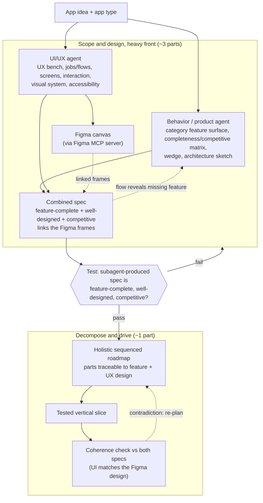

# App-scale PM role, two composing agents (behavior + UI/UX)

> TL;DR: craft gains an application-scale PM/architect discipline that front-loads scope and design
> before code. Two composing subagents, a **behavior/product agent** and a **UI/UX agent** (designing
> in Figma), produce one spec that is **feature-complete and well-designed, competitive with the
> best-in-class for the app type**, which is then decomposed holistically and driven slice by slice.
> Success is gated on one test: a subagent, given only an app idea and type, autonomously produces
> that spec.

This is the contract the later phases implement. It defines the two roles, their boundary, the
stages, and the bar. It does not implement the skills; it says what they must do.

## Problem / Motivation

Application-scale work falls flat under craft's current one-pass shape (a thin plan, then code). The
exemplar is ReviewBridge: a real eight-project WPF app whose first integrated pass was barely usable,
followed by many iterations that felt piecemeal rather than driven by one plan.

Two distinct causes produce "barely usable", and craft addresses neither today:

1. **Feature-incompleteness.** Nothing makes the agent enumerate the category's table-stakes feature
   surface before building, so core features are discovered late, one iteration at a time.
2. **No UI/UX design.** Even a feature-complete plan ships an unusable app when the experience is
   improvised in code. ReviewBridge had a vision spec and research docs but no design artifact; the
   UX was invented at the keyboard.

The structural gaps, verified in the repo: only two read-only *code-review* agents exist, so the
human is both PM and designer; the `decompose` skill is deliberately anti-holistic (one level at a
time, "let work reveal the next level"); `implementation` is per-feature with no scoping,
architecture, or design stage above it. craft's own compose/journal substrate has zero data written,
so whatever role we add must also actually engage, not merely exist.

## Goals

- A subagent produces a spec that **covers the category's table-stakes feature surface, each feature
  sourced**, so that the build is not missing core features.
- The spec carries a **real UI/UX design rendered in Figma** (flows, screens, interaction, a visual
  system, accessibility), so that the first integrated pass is usable rather than improvised.
- The spec is **competitive with named best-in-class incumbents on both features and experience**, so
  that the product has a defensible reason to exist.
- The role **front-loads scope and design over code** (the user's ~3:1 intent), so that
  implementation is anchored to one holistic plan instead of accreting piecemeal.

## Non-Goals

- **Re-tuning the lightweight `decompose` skill.** It stays as is for feature/chore work; app-scale
  decomposition is a new, separate stage. Out, because its YAGNI discipline is correct at its scale.
- **Hard enforcement of the discipline.** Hooks inject context, they cannot veto a tool call, so
  "refuse to code until designed" is a strong nudge, not a gate. Out, because the host does not
  support it.
- **Pixel-perfect mockups.** Design fidelity is wireframe / interaction / design-system level. Out,
  because usability and reviewability, not polish, are the bar at spec time.
- **Building a fleet dispatcher.** The roadmap parts are *shaped* to be dispatchable later; no
  dispatcher ships here. Out, to keep the first delivery to the discipline.
- **Web-only UI generators (v0, Builder.io).** Out, because their code output couples the design to a
  web stack and many app types (ReviewBridge is WPF/XAML) are not web.

## Proposal / Design

The mental model: **two specialist subagents feed one combined spec, which feeds a holistic
decomposition, which drives implementation, with a coherence check after every part.** The behavior
agent owns *what the app does*; the UI/UX agent owns *how it is used and looks*. Neither alone solves
"barely usable"; together they do.

### Diagram

### The two agents and their boundary

| Concern | Behavior / product agent | UI/UX agent |
|---|---|---|
| Owns | What the app does | How it is used and looks |
| Produces | Feature surface, logic, data model, architecture sketch; the completeness/competitive matrix | Jobs/flows, screen inventory, interaction model, wireframe layout, visual design system, accessibility |
| Grounding | `research` skill: category feature surface + incumbent differentiators, each sourced | `research` skill: incumbent UX bench; design rendered in Figma |
| Artifact | The behavior half of the spec | A Figma design (canvas frames) + the design half of the spec that links them |
| Competitive on | Features | Experience |

The boundary is deliberate: a single combined agent shortchanges UX (the exact failure this design
exists to fix), so the disciplines are split and composed, with a reconciliation loop where a UX flow
can surface a missing feature back to the behavior agent.

### The stages

1. **Scope to spec (heavy front).** Both agents run. Behavior derives the feature-complete,
   competitive feature surface and architecture sketch; UI/UX designs the experience for it in Figma.
   Output: one combined spec, feature-complete and well-designed, every feature and parity claim
   sourced, linking the Figma frames.
2. **Architect and decompose holistically.** Turn the validated spec into one living, sequenced
   roadmap: the whole project broken into small, independently-shippable parts in dependency order,
   riskiest first, every part traceable to a feature and its UX design. This is the app-scale
   counterpart to the lightweight `decompose` skill.
3. **Drive with coherence checks.** Implement each part in tested vertical slices (reusing the
   `implementation` skill), then check the result back against both specs (including that the built UI
   matches the Figma design) before moving on; re-plan when a slice contradicts the spec.

### Figma as the design surface

The UI/UX agent writes its design to the Figma canvas (frames, components, variables, auto-layout)
through the Figma MCP server, extracts design context back, and the spec links those frames as the
visual source of truth. The Figma MCP server is free during its beta and is slated to become a
usage-based paid feature later (Figma, "Guide to the Figma MCP server"). A stack-agnostic design spec
(text flows and tokens) is emitted alongside, so the design survives when Figma is unavailable and so
desktop app types, where Figma's web-targeted code generation does not apply, still get a usable
handoff.

### The test (definition of done for the discipline)

> A subagent, given only an app idea and app type, autonomously produces a spec that is high-quality,
> feature-complete, well-designed (in Figma), and competitive with the best-in-class for the app type.

This is the riskiest slice and gates everything downstream: if the agents cannot produce that spec,
the decomposition and drive stages are moot. The oracle scores feature coverage against the
category's real table-stakes set, UX design presence and quality in Figma against incumbents, and the
defensibility of the wedge.

## Alternatives considered

- **One combined PM+designer agent.** Simpler to wire. Rejected: a single agent reliably shortchanges
  UX under feature pressure, which is the precise cause of the barely-usable first pass; splitting the
  disciplines is the fix, not an accident of structure.
- **Spec-only UX, no design tool.** Cheapest, fully host-agnostic. Rejected as the *primary* path:
  text wireframes alone are too low-fidelity to prove a usable experience or to be competitive on UX.
  Kept as the fallback layer, not the headline.
- **Web UI generators (v0, Builder.io) for the design.** High fidelity, directly runnable. Rejected:
  the output couples the design to a web stack, and many target app types are desktop or CLI.
- **Re-tune `decompose` to plan the whole tree up front.** Rejected: it would break a skill whose
  one-level-at-a-time discipline is correct at feature scale; app-scale decomposition belongs in a
  new stage instead.
- **Do nothing.** Rejected: the one-pass shape is exactly what produces piecemeal app-scale builds.

## Risks / blast radius

| Risk | Severity | Mitigation |
|------|----------|------------|
| Figma MCP is beta and becomes paid later | M | Keep the tool-agnostic spec as a fallback; isolate Figma behind the UI/UX agent; Penpot documented as an open-source escape hatch |
| Figma's remote MCP server only accepts allowlisted clients (VS Code, Cursor, Claude Code per the install docs); Copilot CLI may not connect | H (verified) | **Verified by probe:** Figma enforces the allowlist at OAuth Dynamic Client Registration by validating `redirect_uri`. A `cursor://` redirect registered (200); all loopback `http://127.0.0.1`/`localhost` and generic `https` redirects (Copilot CLI's style) were rejected (400/403). So **Copilot CLI cannot connect natively.** Run the UI/UX agent under an allowlisted host (craft is host-agnostic and supports Claude Code, which is documented-supported), or pursue the Figma client waitlist; the `figma-mcp-spike` settles host choice before anything is built on it |
| Figma code generation is web-centric, mismatched to desktop/WPF app types | M | Use Figma for visual design and flows only on non-web stacks; keep the design spec stack-agnostic for handoff |
| The subagents cannot produce a competitive, feature-complete spec | H | This is the gated test; build and validate it first, before any downstream phase |
| True 3:1 scope:code is unrealistic in one session (context limits) | M | Realize the heavy front across sessions and a future fleet; the living plan is the connective tissue |
| The holistic plan drifts from the build | M | "Holistic" means traceable, sequenced, and coherence-checked, not frozen; the drive stage re-plans on contradiction |
| The discipline is added but never engages (compose/journal are unused today) | H | A later phase makes the role fire via session-start steering plus a one-time adopt-repo seed |

## Validation / test plan

- **Headline (gated):** a subagent produces the spec; oracle as above, scored against an app type with
  known incumbents (ReviewBridge's category, with its `0002` vision as a partial reference, noting it
  lacks the UX design this test now demands).
- **Figma round-trip:** a write-to-canvas plus extract-context cycle from a craft subagent, proven in
  the `figma-mcp-spike` phase before the UI/UX discipline is built on it.
- **Per stage:** each later skill ships with the behavior-change check craft requires before a skill
  is added (does loading it make the agent do the discipline it otherwise skips).

## Open questions

- [ ] Q1: Which app type anchors the gated test bar? -- owner: caleb -- resolve by: validate phase
- [ ] Q2: How is a subagent invoked and handed the app brief, and how does it return artifacts (spec
      files + Figma file URL)? -- owner: caleb -- resolve by: figma-mcp-spike
- [ ] Q3: Where does the living roadmap live, the compose tree or a bridge to the CLI-native
      plan/todos surface? -- owner: caleb -- resolve by: living-plan-and-engage
- [ ] Q4: Does any CLI hook beyond sessionStart/postToolUse exist that would allow per-prompt
      steering? -- owner: caleb -- resolve by: living-plan-and-engage

## References

- Foundation and work composition: [`0001-foundation-and-work-composition.md`](0001-foundation-and-work-composition.md)
- ReviewBridge feature-complete vision (exemplar, behavior-only): ReviewBridge `docs/design/0002-feature-complete-vision.md`
- Figma MCP server: https://help.figma.com/hc/en-us/articles/32132100833559-Guide-to-the-Figma-MCP-server
- craft skills: `plugins/craft/skills/` (research, implementation, decompose, clarify-intent, writing-spec, writing-documentation)
