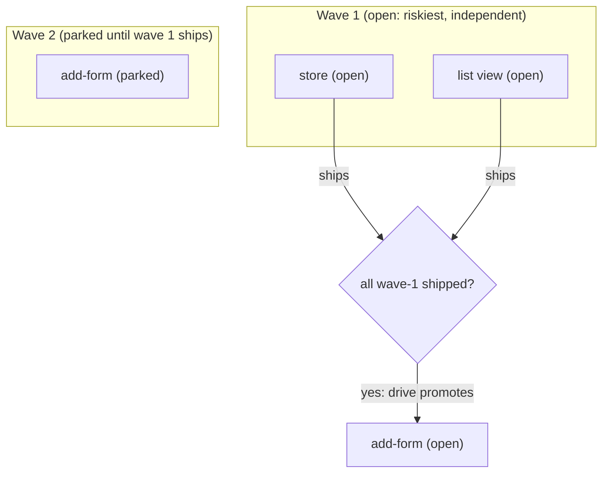

# Fleet-ready, app-decompose output as orchestrator work

> TL;DR: The autonomous fleet already exists (the `cdblake1/orchestrator` Go daemon plus its built-in
> `bridge/`). craft does not build a dispatcher. craft's job is to make `app-decompose` produce compose
> **leaf items** that satisfy the bridge's public ready-leaf contract, and to encode build order as
> status **waves** so a dependency-unaware dispatcher runs the roadmap in the right sequence. No new
> compose MCP code is needed; the work is in the skills, a conformance test, and this doc.

## Problem / Motivation

craft's app-PM role decomposes a validated spec into a roadmap, but a roadmap only delivers an
application if something executes its parts. Running every part by hand in one session does not scale
to application size (the original pain). The fleet is the executor, but craft and the fleet must meet
without coupling: a craft change must not break the fleet, and craft must not depend on fleet
internals.

The fleet side is already built and already designed for this seam:

- **`cdblake1/orchestrator`** is a repo-agnostic autonomous-delivery daemon (phases P0-P5 complete,
  dogfooded): a durable SQLite WorkItem queue with leases, supervised `copilot --output-format json`
  subprocesses, per-target config, verification with retry-on-red, draft-PR creation, and a merge
  policy. It has a `spec-first` build strategy that runs the craft AIM/DESIGN/DELIVER workflow, and a
  generic `GET /outcomes` query.
- **`bridge/`** (its own Go module, an anti-corruption layer) is the only component that knows both
  systems. Each tick it reads ready compose leaves over the **compose MCP**, maps each to a WorkItem,
  enqueues via `orchestratord -mode enqueue`, reads `GET /outcomes`, and writes terminal status back
  via `compose_status`.
- The orchestrator's design `0002-fleet-compose-integration.md` fixes the decoupling rules and states
  the craft side needs **nothing new**: `compose_tree` (read) and `compose_status` (write-back) are
  the contract.

So fleet-ready is a craft-side conformance task, not a build.

## Goals

- `app-decompose` produces compose leaf items that the existing bridge accepts as work, so a roadmap
  can be dispatched with no bridge or orchestrator change.
- A sequenced roadmap with real dependencies runs in the right order, so a dependency-unaware
  dispatcher never starts a part before its predecessor ships.
- The contract is locked by a test, so a future compose change that would break the bridge fails in
  craft's own suite first.

## Non-Goals

- **Building or changing the dispatcher, the bridge, or the orchestrator.** Out: they are built and
  decoupled by design; touching them would violate the seam.
- **A dependency edge in the compose model.** Out: compose stays a hierarchy (roadmap/plan/item);
  ordering is expressed in status waves instead (below). A `depends_on` field is a possible future
  change, not this one.
- **A craft `compose_ready` convenience tool.** Out for v1: orchestrator 0002 says `compose_tree` plus
  a client-side filter suffices, and the bridge already does that filter.

## The contract (what the bridge consumes)

A **compose leaf item == one orchestrator WorkItem.** The bridge (see `bridge/README.md`) selects a
leaf as ready iff all three hold:

1. `status == "open"`,
2. it has a parent `plan_id`,
3. it carries a non-empty `next_action`.

It then maps, from MCP-returned fields only:

| compose field | WorkItem field | note |
|---|---|---|
| item ULID | `external_id` | idempotency key; re-ticks dedup on `(target, external_id)` |
| `severity` | `value` | high=30, medium=20, low=10, info=5; unknown -> 10 |
| `category` | `kind` | pass-through |
| `title` + `notes` + `next_action`, with the parent plan `body` as context | `prompt` | plus a footer (scope: this item only; draft PR; no unrelated changes) |

Every field above already exists on a compose item (`createItem` accepts `title`, `status`,
`category`, `severity`, `plan_id`, `notes`, `next_action`). That is why no compose MCP change is
required.

### What app-decompose must put where

- **Parent plan `body`:** the shared context (spec excerpt, architecture boundary, delivered
  features). The bridge folds it into every child's prompt, so cross-part context lives here once.
- **Leaf `next_action`:** the concrete task, written to be executed cold, including the definition of
  done and the traced spec feature / UX surface. This is the spine of the dispatched prompt.
- **Leaf `title` / `notes` / `severity` / `category`:** summary, supporting context, priority, kind.

## The wave rule (ordering for a dependency-unaware dispatcher)

The bridge pulls **every** `open` leaf each tick; it has no view of dependency edges, and compose
stores none. So build order is encoded in **status**:

- A part is `open` only when its predecessors have shipped; until then it is `parked` (or has no
  `next_action`), so it fails the ready test and is not dispatched early.
- The `open` parts at any moment are one wave: mutually independent, safe to run in parallel.
- When a wave ships, the `drive` stage promotes the next wave to `open` as it reconciles completed
  parts. This promotion is the craft-side substitute for the dependency edge the model does not store,
  and it makes the same roadmap drivable by hand or by the fleet, identically.

## Decoupling (why this stays clean)

- craft touches only its own compose MCP and skills. It contains no orchestrator or bridge concept.
- The orchestrator and bridge contain no craft concept; the bridge speaks to craft only through the
  public `compose_tree` / `compose_status` MCP tools.
- If craft changes compose's storage, only the compose MCP implementation changes; the bridge (which
  uses the tool) and the orchestrator (which knows nothing) are untouched. This doc's conformance test
  guards the field-level contract from the craft side.

## Validation / test plan

- `plugins/craft/mcp-servers/compose/fleet-conformance.test.js` builds a sample app-decompose-style
  tree through the real compose model and asserts: wave-1 leaves are bridge-ready; a parked wave-2
  leaf is not; promoting it after wave 1 ships makes it ready; every ready leaf has a value-mapping
  severity and a category; the parent plan body carries context; and the negative cases (empty
  `next_action`, orphan with no `plan_id`) are correctly rejected. It encodes the bridge's public
  predicate as the oracle and imports no orchestrator code.
- The bridge's own Go tests (in the orchestrator repo) cover the mapping and write-back with faked
  clients; this doc does not duplicate them.

## Deployment dependency (note)

For a dispatched worker to actually use the craft skills (`product-spec`, `uiux-design`, `drive`,
etc.), craft must be installed in the orchestrator's agent environment. The orchestrator's `spec-first`
strategy already assumes the craft workflow, and craft's skill propagation (sessionStart catalog +
`userPromptSubmitted` router) is what makes the worker pick up the right skill. This is an environment
setup note, not a code dependency.

## Open questions

- [ ] Q1: Should the next-wave promotion be a manual `drive`-stage step (current design) or an
      automated craft-side coordinator that watches `compose_status` write-backs? -- owner: caleb --
      resolve by: first real fleet-driven build
- [ ] Q2: Is a `depends_on` field on compose items worth adding later, so the bridge (or a future
      `compose_ready`) can compute readiness instead of relying on status waves? -- owner: caleb --
      resolve by: after observing wave gating in practice

## References

- Orchestrator design: `cdblake1/orchestrator` `docs/design/0002-fleet-compose-integration.md`,
  `0003-orchestrator-outcomes-query.md`, `0005-strategy-templates.md`
- Bridge: `cdblake1/orchestrator` `bridge/README.md`
- craft role contract: [`0002-app-pm-behavior-and-uiux.md`](0002-app-pm-behavior-and-uiux.md)
- Skills: `plugins/craft/skills/app-decompose/SKILL.md`, `plugins/craft/skills/drive/SKILL.md`
- Conformance test: `plugins/craft/mcp-servers/compose/fleet-conformance.test.js`
