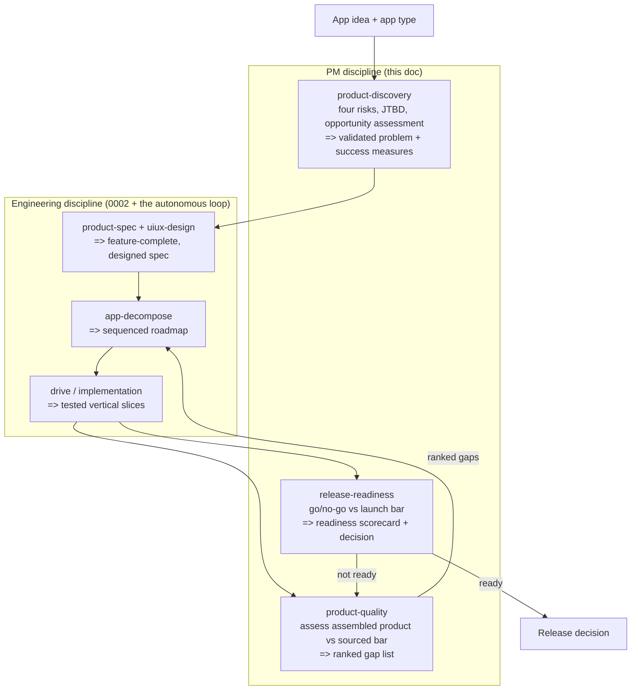

# A PM discipline for craft, discovery to quality iteration to release readiness

> TL;DR: craft gains a product-management discipline that runs alongside the engineering one. Three
> arcs (discovery and validation, quality iteration, release readiness) each become one small skill,
> grounded in the real PM category and sourced. The headline is quality iteration: the corpus has
> gates for spec quality, per-slice code quality, and merge safety, but nothing asks whether the
> assembled product is actually good. That missing gate is what made ReviewBridge feel piecemeal.
> This doc is the contract the skills implement; it does not implement them.

This is the sibling of [`0002-app-pm-behavior-and-uiux.md`](0002-app-pm-behavior-and-uiux.md). That
doc gave craft a *scoping and design* discipline (the behavior and UI/UX agents that produce a
feature-complete, well-designed spec). This doc gives craft the rest of the PM lifecycle that bookends
the build: deciding the right thing *before* the spec, and judging the product *after* the slices land.

## Problem / Motivation

craft can now produce a feature-complete spec, build it slice by slice, and gate each slice on code
review. It still cannot answer "is the assembled product any good, and what should we fix next." The
gates it has are local; none is about the product as a whole.

The exemplar is ReviewBridge. A review of its merged main found every named feature present and
tested, yet its own validation plan (a parity comparison against CodeRabbit, a fix-loop latency
threshold) had never run, some shell commands were still labelled placeholders, and competitive
quality was unproven. Feature-complete by checklist, quality unvalidated. The later iterations felt
piecemeal precisely because no step assembled the product, measured it against a bar, and fed a
ranked list of gaps back into the plan.

Three structural gaps, verified against the corpus:

1. **No discovery gate.** `clarify-intent` converges on what the user asked for; nothing validates
   that the thing is worth building, for whom, and against which risks, before `product-spec` commits
   the feature surface.
2. **No product-quality loop.** `spec-review` gates the plan, the LCR check gates a slice, and
   `conflict-resolve` gates a merge. Nothing assesses the assembled product against a measurable
   quality bar and turns the result into prioritized work. This is the headline gap.
3. **No release-readiness gate.** Nothing runs the spec's validation plan or checks the launch bar
   (rollout, rollback, accessibility, privacy) before a build is called done.

## Goals

- A skill makes the agent **frame and validate the opportunity before solutioning** (the four product
  risks, the job to be done), so the build starts from a validated problem, not a feature list.
- A skill makes the agent **assess the assembled product against a measurable, sourced quality bar and
  emit a prioritized gap list** that feeds `app-decompose`, so quality iteration is holistic instead
  of piecemeal. This is the headline.
- A skill makes the agent **decide release readiness against an explicit go/no-go bar** (the spec's
  validation plan executed, plus rollout, rollback, accessibility, privacy), so "done" is a decision,
  not an assumption.
- Each arc is **grounded in the real PM category, every load-bearing claim sourced**, so the
  completeness claim is checkable rather than asserted (the bar `product-spec` set).
- The corpus **composes with the existing skills** and stays small (three skills plus this contract).

## Non-Goals

- **Re-deriving the scoping and design discipline.** 0002 owns the behavior and UI/UX spec. Out,
  because this doc bookends that one, it does not replace it.
- **Building the orchestrator wiring now.** Where the PM gates slot into `craft-autonomous.yaml` is
  *shaped* here and built later, exactly how 0002 shipped its skills before its loop integration. Out
  of this delivery.
- **Literal continuous customer research.** Several PM table stakes (weekly customer interviews, a
  live product trio) assume a human org with reachable customers. The agent works from an app brief.
  Out as written; the value those practices protect is met by research-grounded evidence instead, and
  the substitution is stated per row in the matrix.
- **Live production telemetry as a gate.** North-star metrics, SLOs, error budgets, and lifecycle
  funnels require a running product with users. The corpus *defines* these targets in the spec; it
  does not pretend to measure them pre-launch. Out as a measured gate, in as a defined artifact.
- **A standalone prioritization skill.** Prioritization (impact over effort, riskiest first) is a
  method used inside discovery and quality, not a fourth skill. Out, to keep the corpus small;
  revisited only if a real consumer needs it on its own.
- **Hard enforcement.** As in 0002, hooks inject context and cannot veto a tool call. The discipline
  is a strong nudge, not a gate the host can enforce.

## Proposal / Design

The mental model: **the PM discipline is a ring around the engineering loop.** Discovery sits before
the spec, release readiness sits after the build, and quality iteration is the feedback arc that turns
the assembled product back into prioritized work. Each arc is one skill.

### Diagram

### The three arcs as three skills

| Skill | Arc | Question | Runs | Consumes | Produces |
|---|---|---|---|---|---|
| `product-discovery` | Discovery and validation | Is this the right thing, for whom, worth it? | Before `product-spec` | The brief | A validated problem statement, the four-risk read, success measures |
| `product-quality` *(headline)* | Quality iteration | Is the assembled product good, what is next? | After slices land | The `product-spec` matrix, the `uiux-design` bar, the spec validation plan | A scored assessment and a prioritized gap list for `app-decompose` |
| `release-readiness` | Release readiness | Is it ready to ship? | Terminal, over the build | The validation plan, the launch bar | A readiness scorecard and a go/no-go decision |

The boundary with existing skills is deliberate. Discovery feeds `product-spec` rather than duplicating
its competitive grounding. Quality consumes the artifacts `product-spec` and `uiux-design` already
produce and feeds `app-decompose` rather than slicing work itself. Release readiness executes the
validation plan the spec already wrote rather than inventing a new one.

### Completeness and competitive matrix

The three tables below are the feature-completeness evidence. Each row is a table-stakes PM function
drawn from the research, the frameworks that back it, and how the craft corpus covers it or why it is a
reasoned non-goal. Sources are in the References section.

**Arc 1, discovery and validation (`product-discovery`)**

| Table-stakes function | Backed by | craft corpus coverage |
|---|---|---|
| Frame the problem as a job or opportunity before solutioning | SVPG opportunity assessment Q1; Torres OST; JTBD; Lean Startup | Covered: the skill's first stage states the problem and the job before any solution |
| Validate value risk before committing engineering | SVPG four risks; Lean Startup MVP; dual-track | Covered by evidence: value is argued from category research and incumbent demand, the agent has no live customers |
| Validate all four risks, not just usability | SVPG four risks; anti-pattern "one-dimensional discovery" | Covered: the skill produces an explicit value, usability, feasibility, viability read |
| Identify and test the riskiest assumption first, cheaply | Lean Startup; Torres OST step 7; dual-track | Covered: the skill names the riskiest assumption and routes it to a spike, which `app-decompose` already sequences first |
| Measure outcomes, not outputs | SVPG; Torres; Lean Startup | Covered: the skill defines success as outcome measures, handed to `product-spec` and `release-readiness` |
| Maintain continuous weekly customer contact | Torres keystone habit; SVPG good-team | Reasoned non-goal: no live customers from a brief. Substituted by research-grounded evidence and the incumbent bench `product-spec` builds |
| Run discovery and delivery as parallel tracks | Dual-track; SVPG continuous discovery | Adapted: a single agent run is sequential, but the quality arc reopens discovery when a gap demands it, which is the loop in miniature |
| Discovery is a cross-functional trio | SVPG; Torres; dual-track | Adapted: the behavior and UI/UX agents from 0002 are the trio's two non-engineering seats; the third is the implementation skill |

**Arc 2, quality iteration (`product-quality`)**

| Table-stakes function | Backed by | craft corpus coverage |
|---|---|---|
| Define measurable quality signals before judging quality | Google HEART, goals-signals-metrics | Covered: the skill defines goals, signals, metrics for the app type before scoring |
| Rank work by impact versus effort before committing | RICE; WSJF; impact/effort | Covered: the gap list is ranked, the headline output |
| Discount confidence, penalize gut-feel without data | RICE confidence; opportunity scoring | Covered: each gap carries a confidence note, sourced to the assessment evidence |
| Sequence by cost of delay, not only expected value | WSJF | Covered: ranking favors gaps that block the wedge or a release gate |
| Define importance versus satisfaction to find underserved gaps | Opportunity scoring; Olsen 2x2; Ulwick | Covered: the assessment scores each spec feature on present-versus-expected, the gap is the deficit |
| Classify by the kind of satisfaction a feature gives | Kano | Covered: gaps are tagged must-be, performance, or delight, which shapes the ranking |
| Anchor to one leading outcome metric | North Star; AARRR | Defined, not measured: the skill names the north-star for the app type, it cannot measure it pre-users |
| Measure across the full lifecycle, not just acquisition | AARRR; HEART | Defined, not measured: signals span the lifecycle, live measurement is out pre-launch |
| Define "done" formally before delivery; separate team DoD from story acceptance | Scrum DoD; Atlassian acceptance criteria | Covered: the assessment checks each slice against the spec's definition of done and acceptance criteria |

**Arc 3, release readiness (`release-readiness`)**

| Table-stakes function | Backed by | craft corpus coverage |
|---|---|---|
| Explicit go/no-go gate with a named decision owner | Google LCE; PRR; Scrum DoD; GTM | Covered: the skill renders a single go/no-go verdict with reasons |
| Success metrics defined before launch | LCE; SRE SLO; Scrum sprint goal | Covered: the skill confirms the spec's success measures exist and are testable |
| Run the spec's validation plan | the spec contract itself | Covered: executing the plan is the skill's core step, the thing ReviewBridge skipped |
| Accessibility conformance (WCAG AA) | W3C WCAG 2.2 | Covered: an accessibility check is a gate item |
| Security and privacy review, no PII leak | LCE security review; NIST RMF; the repo PII rule | Covered: a privacy and secret-leak check is a gate item |
| Staged rollout with automated rollback and a kill switch | LCE; SRE; Fowler feature flags | Shaped: the skill checks that a rollout and rollback story exists, for a prototype this can be a reasoned non-goal |
| Monitoring and alerting live before launch | LCE; SRE best practices; PRR | Shaped: defined for a service, a reasoned non-goal for a pre-users prototype |
| Support and documentation readiness | GTM; PRR; Scrum DoD | Covered: a docs-and-help check is a gate item |
| Postmortem or learning loop wired in | SRE blameless postmortem; Scrum retrospective | Covered: the skill records what the build proved and what to revisit, feeding the quality arc |

### The wedge

The defensible differentiator is an **AI-executable PM discipline that closes the assemble, assess,
re-prioritize loop and composes directly with an autonomous engineering loop.** Every framework in the
References assumes a human PM, a human org, and live customers. None of them is written to be executed
by an agent on a brief, and none of them is wired to feed a dependency-ordered roadmap a fleet can
build. The wedge is not a new framework. It is the translation of the category's table stakes into a
discipline an agent runs, with the one loop the category never had to make explicit because a human
held it: take the assembled product, score it against a sourced bar, and hand the ranked gaps back to
the planner. That loop is what was missing when ReviewBridge felt piecemeal, and it is hard to copy
because it depends on the rest of the craft substrate (the sourced spec matrix, the holistic
decomposition, the drive loop) already being in place.

### Composition with the engineering loop, and the deferred wiring

Today the autonomous loop is spec, spec-review gate, build, code-review gate, strip, merge,
conflict-resolve. The PM arcs slot in at three seams, shaped here and built later:

- **Discovery** runs before the spec prompt, or as a pre-spec gate whose denial sharpens the brief.
  Its output is an input to `craft-autonomous-spec.md`.
- **Quality iteration** runs after a wave of slices merges, not after every slice (the LCR check
  already gates the slice). It is a periodic product-level pass whose ranked gaps become the next
  `app-decompose` wave. In orchestrator terms this is a new post-merge phase, not a per-item gate.
- **Release readiness** runs as a terminal gate over the assembled build, a go/no-go that either ships
  or routes back through quality. In orchestrator terms this is a final check before the build is
  called done.

The wiring is deferred because each seam needs an orchestrator mechanism that does not exist yet (a
pre-spec gate, a post-wave product pass, a terminal gate). 0004 names the seams so the later phase has
a target; it builds none of them.

## Alternatives considered

- **One combined PM skill.** Simpler to wire. Rejected: the three arcs run at different times against
  different inputs and outputs, folding them hides the headline quality loop inside a discovery-shaped
  skill and reproduces the "one pass" problem this work exists to fix.
- **A standalone prioritization skill.** Clean in theory. Rejected: prioritization has no natural
  consumer on its own here, it is always ranking a discovery opportunity set or a quality gap set, so
  it lives as a method inside those two skills.
- **Skip discovery, start at the spec.** Cheapest. Rejected: it leaves the "is this the right thing"
  risk entirely on the human, the same gap 0002 noted for UX, and the four-risk read is cheap to add.
- **Measure live metrics as the quality bar.** Most rigorous. Rejected as a gate: a pre-users build
  has no telemetry, so the bar is a defined-signals bar plus the spec matrix, not a measured one. The
  defined signals become measurable once the product has users, which is a later concern.
- **Do nothing.** Rejected: the missing product-quality loop is the documented cause of piecemeal
  app-scale iteration.

## Risks / blast radius

| Risk | Severity | Mitigation |
|------|----------|------------|
| The PM category assumes humans and live customers, so a naive port produces theater | H | Every adapted or non-goal row in the matrix states the substitution; the skills do the reasoning disciplines, not the human-only rituals |
| Quality assessment without users is subjective | M | Anchor to the sourced spec matrix and goals-signals-metrics, score present-versus-expected, not taste; require each gap to cite evidence |
| The discipline is added but never engages (the 0002 concern) | H | Same mitigation path 0002 used, session-start steering plus an adopt-repo seed, deferred with the wiring |
| Three skills is still scope; the corpus bloats | M | Hard cap at three plus this contract, prioritization embedded, no fourth skill without a proven consumer |
| Release-readiness gates a prototype too hard | M | Service-only gates (rollout, monitoring, SLO) are explicit reasoned non-goals at prototype scale, the skill scales its bar to the build stage |

## Validation / test plan

- **Per skill, the craft behavior-change test (the 0002 precedent):** does loading the skill make the
  agent perform the discipline it otherwise skips. For `product-discovery`, an agent given a brief
  produces the four-risk read and the riskiest-assumption spike rather than jumping to a feature list.
  For `release-readiness`, an agent asked if a build is done runs the validation plan and the launch
  bar rather than asserting done.
- **Headline, `product-quality` validated against ReviewBridge:** given ReviewBridge's merged main and
  its spec, the skill must surface, unprompted, the same gaps the manual review found, the unrun
  validation plan, the placeholder shell commands, and the unproven competitive parity, and rank them.
  This is the falsifiable oracle for the headline arc.
- **Completeness, checkable:** the matrix covers every table-stakes function from the research or
  carries a reasoned non-goal, and each row traces to a source. A reviewer can verify the claim
  against the References rather than trust it.

## Open questions

- [ ] Q1: Does quality iteration run per wave or only at app milestones? Default per wave, settle when
      the wiring phase has a post-merge mechanism. Owner caleb.
- [ ] Q2: Is discovery a pre-spec gate (deny-capable) or a pre-spec input only? Default input first,
      gate later. Owner caleb.
- [ ] Q3: For app types with no clear incumbents, does the quality bar degrade to the spec matrix
      alone, or pull from adjacent categories the way `product-spec` does? Owner caleb, resolve in the
      `product-quality` build.
- [ ] Q4: Where does the readiness scorecard live so a human and a fleet can both read it, the compose
      tree or a build artifact? Owner caleb, ties to the deferred wiring.

## References

Discovery and validation:

- SVPG, The Four Big Risks: https://www.svpg.com/four-big-risks/
- SVPG, Product Discovery: https://www.svpg.com/product-discovery/
- SVPG, Assessing Product Opportunities: https://www.svpg.com/assessing-product-opportunities/
- SVPG, Beyond Lean and Agile: https://www.svpg.com/beyond-lean-and-agile/
- Product Talk, Opportunity Solution Trees: https://www.producttalk.org/opportunity-solution-trees/
- Product Talk, Product Discovery: https://www.producttalk.org/product-discovery/
- Lean Startup, Principles: https://theleanstartup.com/principles
- Jeff Patton, Dual-Track Development: https://jpattonassociates.com/dual-track-development/
- Strategyn, Jobs-to-be-Done and ODI: https://strategyn.com/jobs-to-be-done/ and https://strategyn.com/outcome-driven-innovation-process/
- Christensen Institute, Jobs to Be Done: https://www.christenseninstitute.org/theory/jobs-to-be-done/

Quality and prioritization:

- Intercom, RICE: https://www.intercom.com/blog/rice-simple-prioritization-for-product-managers/
- SAFe, WSJF: https://framework.scaledagile.com/wsjf/
- Kano model (ProductPlan): https://www.productplan.com/glossary/kano-model
- Google Research, HEART, Measuring the User Experience on a Large Scale: https://research.google/pubs/measuring-the-user-experience-on-a-large-scale-user-centered-metrics-for-web-applications/
- Amplitude, North Star Metric: https://www.amplitude.com/blog/product-north-star-metric
- Strategyn, Outcome-Driven Innovation: https://strategyn.com/outcome-driven-innovation/
- Scrum Guide 2020: https://scrumguides.org/scrum-guide.html
- Atlassian, Acceptance Criteria: https://www.atlassian.com/work-management/project-management/acceptance-criteria
- Atlassian, Definition of Done: https://www.atlassian.com/agile/project-management/definition-of-done

Release readiness:

- Google SRE Book, Launch Coordination Checklist: https://sre.google/sre-book/launch-checklist/
- Google SRE Book, Reliable Product Launches at Scale: https://sre.google/sre-book/reliable-product-launches/
- Google SRE Book, Evolving SRE Engagement Model (PRR): https://sre.google/sre-book/evolving-sre-engagement-model/
- Google SRE Book, Service Best Practices: https://sre.google/sre-book/service-best-practices/
- W3C, WCAG 2.2: https://www.w3.org/WAI/standards-guidelines/wcag/ and https://www.w3.org/WAI/WCAG22/Understanding/conformance
- Martin Fowler, Feature Toggles: https://martinfowler.com/articles/feature-toggles.html
- ProductPlan, Go-to-Market Strategy: https://www.productplan.com/glossary/go-to-market-strategy
- NIST SP 800-37 Rev. 2, Risk Management Framework: https://csrc.nist.gov/pubs/sp/800/37/r2/final

Prior craft design:

- 0001, Foundation and work composition: [`0001-foundation-and-work-composition.md`](0001-foundation-and-work-composition.md)
- 0002, App-scale PM role, behavior and UI/UX: [`0002-app-pm-behavior-and-uiux.md`](0002-app-pm-behavior-and-uiux.md)
- 0003, Fleet-ready: [`0003-fleet-ready.md`](0003-fleet-ready.md)
