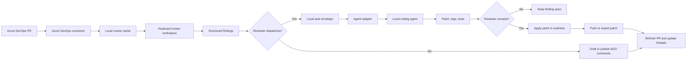

# Build a keyboard-first Azure DevOps review client

> TL;DR: Build a local-first desktop client that lets Azure DevOps reviewers clear pull request queues at keyboard speed, write structured findings, and dispatch selected findings to a local coding agent for reviewer-approved fixes.

## Problem / Motivation

Azure DevOps pull request review has a gap: the source of truth is a browser PR, while the code, tests, and local coding agent live on the reviewer machine.

The app type is a keyboard-first desktop pull request review client for Azure DevOps, with AI-assisted fix dispatch. It sits between two proven categories: pull request review surfaces and AI code review bots. The review category has credible products for PR comments, summaries, rules, AI findings, queues, and agent fixes, but no verified incumbent combines Azure DevOps-native review, desktop keyboard flow, local checkout control, and local agent dispatch in one product.

### Incumbents verified

| Incumbent | Positioning | Verification quote | Source |
|---|---|---|---|
| Azure Repos web PR UI | The Azure DevOps system of record for PR review, comments, suggestions, votes, policies, and thread states. | "You can only review Azure DevOps PRs in the web portal by using your browser." | [Azure Repos review docs](https://learn.microsoft.com/en-us/azure/devops/repos/git/review-pull-requests?view=azure-devops) |
| GitHub Copilot code review for Azure Repos | On-demand AI reviewer inside Azure Repos, in limited public preview. | "Use GitHub Copilot to review pull requests in Azure Repos" and "Copilot acts as an automated reviewer that posts comments and suggestions on changed code." | [Azure Repos Copilot code reviews](https://learn.microsoft.com/en-us/azure/devops/repos/git/copilot-code-reviews?view=azure-devops) |
| CodeRabbit | AI review platform with Azure DevOps support, PR comments, configuration, context sources, IDE, CLI, and agentic finishing touches. | "Automated code reviews", "AI-powered suggestions", and "Interactive assistance" are listed for Azure DevOps. | [CodeRabbit Azure DevOps](https://docs.coderabbit.ai/platforms/azure-devops) |
| Qodo | Enterprise AI code review and governance platform with multi-agent review, rule enforcement, and Azure DevOps installation. | "multi-agent review, rule enforcement, and context-aware feedback directly into pull requests." | [Qodo code review](https://docs.qodo.ai/code-review.md) |
| Greptile | AI reviewer focused on full-codebase context, high-signal comments, learning, MCP, and fix handoff to local agents. | "Every review comment includes a Fix with your Agent button" and "Fix All" sends every issue at once. | [Greptile key features](https://www.greptile.com/docs/code-review/key-features) |
| Graphite | GitHub-centered PR review workflow for stacked changes, PR inbox, AI reviewer, and Cursor Cloud Agent updates. | "Create and update pull requests with Cursor Cloud Agents directly in Graphite." | [Graphite docs llms-full](https://graphite.com/docs/llms-full.txt) |
| Ellipsis | GitHub AI teammate for code review, bug fixes, PR summaries, code generation, and engineering analytics. | "Ellipsis is an AI teammate that installs into your GitHub repositories." | [Ellipsis introduction](https://docs.ellipsis.dev/introduction.md) |
| Microsoft CodeFlow | Microsoft internal client-side code review tool documented as a productivity and research platform. | "CodeFlow remains a tool that works client-side, meaning you can download your change first and then interact with it, which makes switching between files and different regions very, very fast." | [CodeFlow paper PDF](https://cabird.com/pdfs/codeflow2018.pdf) |

### Feature surface evidence

F1-F18 are the table-stakes features a credible entrant must cover. F19-F24 are competitive differentiators or first-release scope choices that shape the wedge.

| ID | Source-backed feature | Evidence quote | Source |
|---|---|---|---|
| F1 | Azure DevOps PR metadata, reviewers, policies, and votes | "All required reviewers must approve the changes in your PR before the changes can merge" and branch policies can require reviewers. | [Azure Repos review docs](https://learn.microsoft.com/en-us/azure/devops/repos/git/review-pull-requests?view=azure-devops) |
| F2 | Browser-only Azure DevOps review is the current baseline | "You can only review Azure DevOps PRs in the web portal by using your browser." | [Azure Repos review docs](https://learn.microsoft.com/en-us/azure/devops/repos/git/review-pull-requests?view=azure-devops) |
| F3 | Rich diff review needs file tree, summary view, side-by-side, inline, and changed-push filtering | Azure Repos documents "Files" tab summary, "Side-by-side" or "Inline" diff layout, and a changes dropdown for pushed changesets. | [Azure Repos review docs](https://learn.microsoft.com/en-us/azure/devops/repos/git/review-pull-requests?view=azure-devops) |
| F4 | Review comments need line, range, file, and PR-level anchors | Azure Repos supports comments on "a specific line or range of lines", "entire file", and "general feedback" on the overview tab. | [Azure Repos review docs](https://learn.microsoft.com/en-us/azure/devops/repos/git/review-pull-requests?view=azure-devops) |
| F5 | Suggested changes are expected in PR comments | Azure Repos says reviewers can "suggest replacement text" and authors can choose "Apply changes". | [Azure Repos review docs](https://learn.microsoft.com/en-us/azure/devops/repos/git/review-pull-requests?view=azure-devops) |
| F6 | Thread status is required for review workflow | Azure Repos comment statuses include "Active", "Pending", "Resolved", "Won't fix", and "Closed". | [Azure Repos review docs](https://learn.microsoft.com/en-us/azure/devops/repos/git/review-pull-requests?view=azure-devops) |
| F7 | AI PR review comments and suggested fixes are table stakes | Copilot "can review your code and provide feedback" and feedback can include "suggested changes". | [GitHub Copilot code review docs](https://docs.github.com/en/copilot/how-tos/use-copilot-agents/request-a-code-review/use-code-review) |
| F8 | AI re-review and update handling are required | CodeRabbit performs "incremental reviews focusing on the new changes" for subsequent commits. | [CodeRabbit overview](https://docs.coderabbit.ai/guides/code-review-overview) |
| F9 | PR summaries and walkthroughs are expected | CodeRabbit lists "AI-generated summaries" and "Comprehensive summaries and walkthroughs". | [CodeRabbit overview](https://docs.coderabbit.ai/guides/code-review-overview) |
| F10 | Findings need severity and category | CodeRabbit documents content categories such as security, stability, correctness, performance, and severity levels from Critical to Info. | [CodeRabbit overview](https://docs.coderabbit.ai/guides/code-review-overview) |
| F11 | Custom rules and instructions are expected | Graphite custom rules can "Define coding standards specific to your codebase" and "Implement architectural guidelines". | [Graphite AI customization](https://graphite.com/docs/llms-full.txt) |
| F12 | Repository-wide and path-specific instructions are expected | Copilot supports repository-wide `.github/copilot-instructions.md` and path-specific `.github/instructions/**/*.instructions.md` files. | [GitHub Copilot code review docs](https://docs.github.com/en/copilot/how-tos/use-copilot-agents/request-a-code-review/use-code-review) |
| F13 | Full repository context is expected for credible AI review | Greptile "builds a graph of your repository" and uses it to reason about "ripple effects beyond the diff." | [Greptile key features](https://www.greptile.com/docs/code-review/key-features) |
| F14 | Cross-repository or system-level context is a competitive feature | Qodo context includes "Repository-level context", "Cross-file relationships", and "Dependencies between components and services." | [Qodo context engine](https://docs.qodo.ai/core-concepts/context-engine.md) |
| F15 | Feedback learning is expected in top AI reviewers | Ellipsis says it will "learn from your feedback to improve future reviews." | [Ellipsis code review](https://docs.ellipsis.dev/features/code-review) |
| F16 | Noise controls and ignore rules are expected | Greptile lets teams tune `strictness`, `commentTypes`, `ignorePatterns`, and review triggers. | [Greptile configuration](https://www.greptile.com/docs/code-review/greptile-json-reference) |
| F17 | Agent fix dispatch is a competitive expectation | Greptile sends the issue to a coding agent with "file paths, line numbers, and suggested code." | [Greptile fix with your agent](https://www.greptile.com/docs/integrations/fix-with-your-agent) |
| F18 | One-click or batch fixing is a table-stakes AI differentiator | CodeRabbit Autofix gathers unresolved review threads, applies fixes, runs setup and build verification, then delivers a commit or stacked PR. | [CodeRabbit Autofix](https://docs.coderabbit.ai/finishing-touches/autofix.md) |
| F19 | Local pre-commit review exists in leading tools | CodeRabbit CLI reviews "uncommitted changes" and can send complex issues "directly to your AI coding agent." | [CodeRabbit CLI](https://docs.coderabbit.ai/cli/index.md) |
| F20 | IDE or local agent integration exists in leading tools | Greptile MCP lets assistants "fetch comments, apply fixes, and manage coding patterns from your editor." | [Greptile MCP overview](https://www.greptile.com/docs/mcp-v2/overview) |
| F21 | PR inbox and review queues are expected for high-throughput review | Graphite creates inbox sections: "Needs your review", "Returned to you", "Drafts", and "Waiting for review." | [Graphite PR inbox](https://graphite.com/docs/use-pr-inbox) |
| F22 | Enterprise deployment, security, and admin controls are required for enterprise AI review | Qodo has multi-tenant, single-tenant, and on-premises models, and Azure DevOps installation support. | [Qodo installation](https://docs.qodo.ai/install-and-configure/install.md) |
| F23 | Analytics are a competitive feature | Greptile tracks "PRs reviewed, merge times, addressed rates, critical bugs caught, and upvote/downvote ratios." | [Greptile docs index](https://www.greptile.com/docs/llms.txt) |
| F24 | Client-side performance is a proven code review differentiator | CodeFlow's client-side model makes switching between files and regions "very, very fast." | [CodeFlow paper PDF](https://cabird.com/pdfs/codeflow2018.pdf) |

## Goals

- Reviewers can triage, read, comment on, and submit Azure DevOps pull request reviews without pointer input so that large review queues cost less attention.
- Reviewers can move through files, hunks, comments, updates, and threads with low-latency local state so that review flow matches CodeFlow's documented client-side speed advantage [F24].
- Review findings carry file span, severity, category, expected behavior, fix intent, and dispatch state so that humans and agents can act on them without re-asking for context [F4, F10, F17].
- Reviewers can dispatch one or more findings to a local coding agent running against a verified checkout so that fixable issues can be corrected while the reviewer stays in the review loop [F17, F18, F20].
- The client keeps source code, prompts, run logs, and patches local unless the reviewer explicitly posts a comment, pushes a branch, or configures an agent that sends data elsewhere, so that enterprise trust is inspectable [F22].
- The client works with existing Azure DevOps pull requests, comments, reviewers, policies, and statuses so that teams do not migrate hosting or review policy [F1, F3, F6].

## Non-Goals

- Replacing Azure DevOps pull requests is out of scope because Azure DevOps remains the system of record for branches, policies, comments, and merge decisions [F1].
- Building another cloud AI reviewer is out of scope because CodeRabbit, Qodo, Greptile, Copilot, Graphite, and Ellipsis already cover cloud-side review generation [F7, F13, F18].
- Fully autonomous review submission is out of scope for the first release because the reviewer must approve comments, patches, pushes, and thread resolution.
- Arbitrary Git provider support is out of scope for the first release because the wedge depends on Azure DevOps PR semantics, identities, policies, iterations, and thread states [F1, F6].
- Mobile and tablet review are out of scope because the core workflow depends on keyboard traversal, local checkout inspection, local tools, and local agent adapters [F19, F20].
- Analytics dashboards beyond local session metrics are out of scope for the first release because Greptile, Graphite, Ellipsis, and CodeRabbit already compete on org-level analytics [F23].

## Root cause

N/A: this is a new product specification, not a bug fix.

## Proposal / Design

The product should win as a local human review cockpit, not as another PR bot.

The wedge is reviewer-approved, Azure DevOps-native fix dispatch from a keyboard-first desktop client into local worktrees and local agents, with every patch audited before any post or push.

### Diagram



### Completeness and competitive matrix

Legend: `Yes` means the cited public source verifies support. `Partial` means the source verifies an adjacent or narrower behavior. `No verified source` means the researched sources did not verify the feature. `Planned` means the proposed product includes the behavior.

| Feature | Azure Repos web | CodeFlow | Copilot CR | CodeRabbit | Qodo | Greptile | Graphite | Ellipsis | Proposed |
|---|---|---|---|---|---|---|---|---|---|
| Azure DevOps PR source of truth [F1] | Yes | Microsoft internal | Yes, preview | Yes | Yes | No verified source | No verified source | Coming soon, not GA | Planned |
| Browser-independent review [F2, F24] | No | Yes | Partial in IDEs, ADO in browser | CLI and IDE | No verified desktop source | MCP and CLI | Web plus CLI | No, cloud GitHub app | Planned |
| PR inbox and saved queues [F21] | Partial | No public source | No verified source | Dashboard metrics, no inbox source | Governance view | Analytics, no inbox source | Yes | Analytics timeline | Planned |
| Rich diff navigation and changed-push review [F3] | Yes | Yes, client-side speed | PR inline comments | PR walkthrough | PR findings | PR summary and comments | PR page | PR comments | Planned |
| Line, range, file, and PR comments [F4] | Yes | Yes by category source | Yes | Yes | Yes | Yes | Yes | Yes | Planned |
| Thread status and resolution [F6] | Yes | No public source | Yes | Resolve command | No verified source | Auto-addressed comments | Comment workflow | No verified source | Planned |
| Suggested changes [F5, F7] | Yes | No public source | Yes | One-click fixes | Feedback explains how to move forward | Suggested fixes | Commit suggestions | Suggested changes | Planned |
| AI review findings [F7] | Copilot preview | No | Yes | Yes | Yes | Yes | Yes | Yes | Optional import, not core |
| Incremental review on new commits [F8] | Iteration view | Change tracking | Manual re-request in ADO | Yes | Pull request history context | Configurable trigger | AI status | Every commit | Planned sync |
| PR summary or walkthrough [F9] | Overview metadata | No public source | No verified ADO source | Yes | Findings list | Yes | Generated PR descriptions | Yes | Planned local summary |
| Severity and issue category [F10] | Comment status only | No public source | No verified source | Yes | Findings | Comment types | Issue categories | Confidence threshold | Planned |
| Custom rules and path instructions [F11, F12] | Branch policies, not AI rules | No public source | Yes | Yes | Yes | Yes | Yes | Yes | Planned repo profiles |
| Full repository context [F13] | No | Local downloaded change | Copilot custom context, not full graph source | Code graph | Context Engine | Yes | Related codebase context | Codebase Q&A | Planned through local index |
| Cross-repo or system context [F14] | No | No public source | MCP preview | Multi-repo analysis | Yes | Cross repo context | Related PRs context | No verified source | Planned after v1 |
| Learns from feedback [F15] | No | Analytics research only | Thumbs feedback | Learnings | Continuous evolution | Team learning | Downvote metrics | Yes | Planned local rules, not global learning |
| Noise controls and ignore patterns [F16] | Filters comments | No public source | No verified source | Config profiles | Review standards | Strictness and filters | Exclusions | Confidence threshold, ignore paths | Planned |
| Agent fix handoff [F17] | No | No public source | Fix with Copilot for GitHub review comments | Autofix | No verified source | Fix with your Agent | Cursor Cloud Agents | Bug fixes | Planned, local-first |
| Batch fix all findings [F18] | No | No public source | Fix with Copilot, scoped source | Autofix | No verified source | Fix All | Agent updates PR | Tag workflow | Planned |
| Local pre-commit review [F19] | No | Client-side review, not AI | IDE local changes | CLI and IDE | IDE product, not PR source | CLI | CLI | No verified source | Planned read-only and fix modes |
| Local IDE or MCP integration [F20] | No | No public source | IDEs | IDE and CLI | MCP in context engine | MCP | Cursor agents | No verified source | Planned adapter API |
| Build or test verification for fixes [F18] | Build policies | No public source | No verified ADO fix source | Setup and build verification | CI analysis source | Agent applies, reviewer reviews diff | Agent commits | Builds and tests in cloud | Planned local commands |
| Enterprise deployment and admin controls [F22] | Enterprise host | Microsoft internal | Org and repo enablement | Self-hosted enterprise | Yes | Self-hosted, SSO | AI privacy controls | GitHub app and API | Planned policy and adapter controls |
| Review analytics [F23] | PR history | CodeFlow analytics | Feedback controls | Metrics API | Organization findings | Yes | AI dashboard | Yes | Local metrics only in v1 |

### Wedge

The defensible wedge is local, reviewer-approved agent dispatch for Azure DevOps reviews: the client owns the keyboard review state, exact Azure DevOps anchors, verified local Git checkout, agent task envelope, patch intake, test output, and post-or-push decision in one audited loop.

Cloud PR bots can generate comments and fixes, and browser PR UIs can host threads. They do not own the local checkout, keyboard-first review session, local agent process, and Azure DevOps thread state at the same time. A desktop client can bind those boundaries because it runs where the code, tools, and agent already run.

### Product model

The client centers on one local review workspace per open pull request.

| Resource | Purpose | Source of truth |
|---|---|---|
| Pull request | Title, description, commits, iterations, reviewers, policies, threads | Azure DevOps [F1, F3, F6] |
| Local checkout | Files, branch, worktrees, build and test commands | User machine [F19, F20] |
| Review session | Read state, filters, cursor position, drafts, findings | Local encrypted cache |
| Agent run | Task envelope, prompt, command log, patch, result | Local run directory |

A workspace can attach to a local checkout when the reviewer wants agent dispatch. Read-only review works without a checkout. Dispatch, patch application, tests, and push require a verified checkout.

### Core behaviors

#### Pull request inbox

The inbox exists to make queue clearing explicit.

- Show PRs assigned to the user, created by the user, watched by the user, or matching saved Azure DevOps queries [F1, F21].
- Group PRs by review state: needs review, returned to you, waiting for review, policy failed, merge conflict, draft, and recently updated [F6, F21].
- Surface changed file count, unresolved thread count, last push, policy state, reviewer state, and agent dispatch eligibility [F1, F3, F6].
- Support keyboard filtering by repository, project, author, branch, status, and saved query [F21].

#### Review workspace

The review workspace is optimized for fast reading, precise comments, and fast return to context.

- Render a file tree with status, comment count, viewed state, generated-file marker, and dispatch-relevant findings [F3, F4].
- Support inline and side-by-side diffs, file summary, changed-push filters, next hunk, next unreviewed file, next thread, next finding, and fuzzy path jump [F3].
- Keep review state across restarts, including viewed files, collapsed regions, filters, cursor position, and draft comments.
- Open the current file and line in the user's configured editor from any diff span [F20].
- Show build, test, and policy context beside the diff, then attach selected command output to a finding or agent run [F18].

#### Keyboard interaction model

Every primary action MUST be keyboard-accessible.

| Key pattern | Action |
|---|---|
| `j` / `k` | Move to next or previous item in the active lane |
| `Enter` | Open selected item |
| `g i` | Go to inbox |
| `g f` | Go to file tree |
| `g d` | Go to diff |
| `g t` | Go to threads |
| `g a` | Go to agent runs |
| `c` | Create comment or finding at the current span |
| `r` | Reply to the selected thread |
| `d` | Dispatch selected finding to the agent |
| `p` | Preview pending comments and patches |
| `s` | Submit approved comments |
| `/` | Search within the PR |
| `Ctrl+K` | Open command palette |

The command palette is the discoverability layer. It lists commands, key bindings, focus scope, and whether a command requires an attached checkout.

#### Structured findings

A finding is a review comment plus machine-readable fix intent.

A finding includes:

- Azure DevOps anchor: file span, file-level anchor, or PR-level anchor [F4].
- Category: correctness, test coverage, security, performance, compatibility, maintainability, product behavior, or style consistency [F10].
- Severity: blocking, should fix, suggestion, or question [F10].
- Expected behavior and observed risk.
- Repro steps, local command output, or linked policy/build evidence when present [F18].
- Suggested fix intent, phrased as a reviewer instruction rather than a patch [F17].
- Dispatch state: not dispatched, dispatched, patch ready, accepted, rejected, posted, or resolved.

Findings can be posted as Azure DevOps comments, sent to an agent, or both. A reviewer can batch related findings into one dispatch when one code change should address the group [F18].

#### Local agent dispatch

Agent dispatch turns selected findings into a bounded local task.

Before dispatch, the client MUST verify:

- The checkout remote matches the Azure DevOps repository.
- The selected branch or worktree matches the pull request source branch.
- The local head matches the pull request head used by the finding.
- The working tree is clean, or the selected mode isolates edits.
- The agent adapter and data boundary are visible to the reviewer.

| Mode | Behavior | Use case |
|---|---|---|
| Patch only | Agent writes a patch file without changing the checkout | Reviewer wants maximum isolation |
| Worktree | Client creates a Git worktree for the PR branch and lets the agent edit it | Reviewer wants safe local edits |
| Current branch | Agent edits the checked-out branch | PR author is reviewing their own PR |

The client sends a task envelope to a local adapter. The first adapters should support CLI process execution and stdio JSON because those work with local agents without a resident service.

```json
{
  "schemaVersion": "1.0",
  "taskId": "finding-1234",
  "repositoryPath": "C:\\src\\repo",
  "pullRequest": {
    "organization": "contoso",
    "project": "App",
    "repository": "Service",
    "id": 42,
    "sourceBranch": "users/alex/fix-null-state",
    "targetBranch": "main",
    "headCommit": "abcdef"
  },
  "findings": [
    {
      "filePath": "src/Reviewer/State.cs",
      "lineStart": 120,
      "lineEnd": 128,
      "severity": "shouldFix",
      "category": "correctness",
      "instruction": "Handle the null review state before reading the reviewer id.",
      "expectedBehavior": "A pull request with no assigned reviewer opens without throwing."
    }
  ],
  "constraints": {
    "mayRunTests": true,
    "mayCommit": false,
    "mayPush": false
  }
}
```

The agent returns a result envelope with patch paths, changed files, explanation, commands run, command exit codes, and open questions. The client treats the result as untrusted input. It renders the diff and requires reviewer approval before applying, committing, pushing, posting, or resolving a thread.

#### Patch intake and review

Patch intake is a second review pass.

- Show the patch against the selected mode's base commit.
- Mark which findings the patch claims to address.
- Show command output and test status next to the diff [F18].
- Let the reviewer accept all, accept selected files, reject all, or send a follow-up instruction.
- Detect conflicts with new pull request commits and require refresh or rerun before applying stale patches.
- Convert accepted findings to comments, resolved threads, or local notes based on reviewer choice [F6].

#### Azure DevOps integration

The client uses Azure DevOps as the only remote source of truth.

- Sign in with Microsoft Entra ID through browser or device flow. Personal access token support SHOULD exist for constrained environments [F1].
- Read PR metadata, iterations, changed files, thread states, reviewers, policy status, build links, and comments [F1, F3, F6].
- Post comments, replies, suggested changes, and thread status updates as the signed-in user [F4, F5, F6].
- Detect stale anchors when a new iteration moves or removes a line [F3, F8].
- Preserve Azure DevOps permissions. The client cannot push, vote, or resolve policy unless Azure DevOps allows the signed-in identity to do so [F1].

#### Local repository integration

The client treats Git as an explicit dependency for write flows.

- Discover local checkouts by matching Azure DevOps remote URLs and repository ids.
- Verify the local branch before author-side fixes.
- Create isolated worktrees for safe patch-generation mode.
- Show dirty working tree state before dispatch and before patch apply.
- Support repository profiles for generated-file patterns, build commands, test commands, default agent adapter, and default dispatch mode [F16, F18].

#### Security and privacy behavior

The security model is local-first and explicit-post.

- Source code and review findings stay local unless the reviewer posts a comment, pushes a branch, or configures an agent that sends data elsewhere.
- The client MUST show adapter command, adapter type, working directory, network declaration, and artifact directory before first dispatch.
- The client MUST warn when an adapter declares network access or cannot declare its data boundary.
- Logs must redact access tokens, authorization headers, and credential vault identifiers.
- Run directories can contain source snippets and prompts. The client must provide retention settings and a delete-run command.

### API / Interface surface

The first release needs three semi-public interfaces: finding schema, repository profile, and agent adapter.

```text
Finding
  id: string
  anchor: FileSpan | FileAnchor | PullRequestAnchor
  category: FindingCategory
  severity: FindingSeverity
  title: string
  body: string
  expectedBehavior: string?
  fixIntent: string?
  dispatchState: DispatchState
  azureDevOpsThreadId: int?
  azureDevOpsIterationId: int?
```

```text
RepositoryProfile
  repositoryId: string
  preferredCheckoutPath: string?
  generatedFilePatterns: string[]
  buildCommands: CommandProfile[]
  testCommands: CommandProfile[]
  agentAdapterId: string?
  defaultDispatchMode: PatchOnly | Worktree | CurrentBranch
```

```text
AgentAdapter
  id: string
  displayName: string
  capabilities: AgentCapability[]
  dataBoundary: LocalOnly | NetworkDeclared | Unknown
  start(taskEnvelopePath, outputDirectory, cancellationToken) -> AgentRunHandle
  cancel(runId) -> AgentRunResult
```

Behavioral requirements:

- The adapter MUST run on the local machine.
- The adapter MUST write prompts, patches, command logs, and result envelopes to a per-run directory under the client data root.
- The adapter MUST support cancellation.
- The adapter MUST report whether it edited the checkout, wrote a patch, or made no change.
- The adapter SHOULD support follow-up instructions against an existing run.

### Implementation notes

The architecture should keep UI navigation independent from network, Git, and agent latency.

| Layer | Responsibility |
|---|---|
| UI shell | Windows, panes, command routing, focus, key bindings, accessibility |
| Review domain | PR model, diff model, findings, viewed state, submit preview |
| Azure DevOps connector | Authentication, REST calls, pagination, retry, rate handling |
| Git service | Checkout discovery, branch validation, worktree creation, patch apply |
| Agent broker | Adapter registry, task envelope creation, run lifecycle, cancellation |
| Patch intake | Diff render, test result binding, accept/reject workflow |
| Local store | SQLite cache, encrypted secret pointers, run records, settings |

Store review state in SQLite under the user's app data directory. Store secrets in the operating system credential vault. Keep only stable secret identifiers in SQLite.

Staleness is a first-class state. Track pull request iteration and head commit for every draft, finding, and patch. On refresh, remap anchors when Azure DevOps supplies enough data. If a span cannot be mapped, preserve the finding as PR-level draft text and mark it stale.

### User flows

#### Flow 1: Review and comment without an agent

1. Reviewer opens the inbox and filters to PRs needing review.
2. Reviewer opens a PR and presses `j` to move hunk by hunk.
3. Reviewer presses `c` on a problematic span and writes a structured finding.
4. Reviewer previews pending comments with `p`.
5. Reviewer submits approved comments to Azure DevOps.

Pass condition: Azure DevOps shows comments at the expected anchors, and the local session marks them posted.

#### Flow 2: Dispatch one finding to a local agent

1. Reviewer creates a correctness finding on a file span.
2. Reviewer presses `d` and selects Worktree mode.
3. Client validates the checkout, creates a worktree, writes the task envelope, and starts the configured adapter.
4. Agent returns a patch and test result.
5. Reviewer inspects the patch, accepts it, and pushes it to the PR source branch if permitted.
6. Client refreshes the PR and marks the finding addressed by the new commit.

Pass condition: the source branch contains the accepted patch, Azure DevOps shows the new iteration, and the agent run record links to the finding.

#### Flow 3: Batch findings into one fix

1. Reviewer selects related findings.
2. Reviewer dispatches them as one task with shared fix intent.
3. Agent returns one patch.
4. Reviewer accepts selected files and rejects an unrelated edit.
5. Client records which findings remain open.

Pass condition: accepted files apply cleanly, rejected files are not modified, and unresolved findings stay visible.

#### Flow 4: Stale PR during review

1. Reviewer drafts comments against iteration 4.
2. Author pushes iteration 5 before submission.
3. Client refreshes and remaps anchors that still match.
4. Client marks unmapped findings stale and blocks one-click submission.
5. Reviewer re-anchors or converts stale findings to PR-level comments.

Pass condition: no comment is posted to the wrong line.

## Alternatives considered

| Alternative | What it is | Why rejected |
|---|---|---|
| Do nothing | Keep using Azure DevOps web UI, local editor, and separate agent sessions | The browser remains the review surface, while code, tests, and agent execution stay disconnected [F2, F19, F20]. |
| Browser extension | Add shortcuts and agent dispatch on top of Azure DevOps web pages | It inherits web UI focus constraints and browser sandbox limits around local worktrees, local agents, and test commands. |
| Azure DevOps web extension | Build the workflow inside Azure DevOps | A web extension cannot own local checkout validation, local process execution, or local artifact retention without a companion app. |
| CLI-only tool | Provide terminal commands for PR review and dispatch | CLI review is fast for experts but weak for rich diffs, anchored comments, patch preview, and screen-reader review of visual diffs [F3, F4]. |
| IDE extension | Put the workflow inside Visual Studio or VS Code | IDE integration is valuable later, but the first product needs a dedicated PR queue and review state that is not tied to one editor session [F21]. |
| Bot-only reviewer | Generate and post review comments automatically | The market already has strong cloud bots [F7, F13, F18]. The wedge is human review plus local fix dispatch. |
| Cloud-hosted fixer | Send findings to a remote agent that commits fixes | CodeRabbit and Ellipsis already cover cloud-generated commits [F18]. The proposed product wins on local trust, local tools, and reviewer-owned patch intake. |

A desktop client is the best first surface because it can combine rich diff UI, keyboard-first control, Azure DevOps thread fidelity, local filesystem access, and explicit agent execution.

## Risks / blast radius

| Risk | Severity (H/M/L) | Mitigation |
|---|---|---|
| Agent edits or deletes unrelated local files | H | Prefer Worktree or Patch-only mode, block apply outside repository root, show changed-file list, and require approval before apply or push. |
| Reviewer posts stale or mis-anchored comments | H | Track PR iteration per finding, remap anchors on refresh, and block submission of stale anchors. |
| Credentials or source snippets leak through logs | H | Store secrets in OS credential vault, redact logs, isolate run directories, and show adapter data-boundary warnings. |
| Agent produces plausible but wrong fixes | H | Treat patches as untrusted, require reviewer diff approval, show tests run, and keep findings open until reviewer accepts. |
| Azure DevOps API limits or outages block review | M | Cache read state, queue writes locally, use incremental sync, and expose retry state. |
| Large PRs make the UI sluggish | M | Virtualize diffs, fetch by iteration and file path, cache rendered chunks, and index search in the background. |
| Keyboard shortcuts conflict with assistive technology or user habits | M | Make bindings remappable, publish a shortcut reference, and test with screen readers. |
| Branch permissions differ across repositories | M | Defer to Azure DevOps permission checks and offer Patch-only mode when push is not allowed. |
| Teams distrust local agent execution | M | Provide transparent run records, adapter allowlists, retention controls, and policy-level dispatch disablement. |
| Local Git state diverges from the PR | L | Validate remote, branch, head commit, and dirty state before dispatch and apply. |

## Validation / test plan

Validation must prove review speed, Azure DevOps fidelity, safe agent dispatch, source grounding, and patch auditability.

| Test type | Scenario | Oracle |
|---|---|---|
| Source audit | Each table-stakes feature links to a source quote and URL | No feature row exists without a source id. |
| Unit tests | Finding schema validation, anchor mapping state, command routing, adapter result parsing | Invalid data is rejected, valid data round-trips, and commands resolve in the correct focus scope. |
| Azure DevOps integration tests | PR sync, comments, suggested changes, replies, thread status, iteration refresh | Local state matches Azure DevOps after each operation, including stale-anchor cases. |
| Git integration tests | Checkout discovery, worktree creation, dirty state detection, patch apply, conflict detection | The client never edits outside the selected repository or applies a patch to the wrong head commit. |
| Agent adapter tests | CLI adapter start, cancellation, timeout, malformed result, patch-only result | Each run ends in a typed state with preserved logs and no orphaned process owned by the client. |
| Accessibility tests | Keyboard-only review, screen-reader announcement, focus order, high-contrast diff colors | A reviewer can complete flows 1 and 2 without pointer input and without color-only signals. |
| Performance tests | PRs with 500 files, generated files, and a 20,000-line diff | Navigation input remains responsive, and first meaningful diff render meets the product target. |
| End-to-end dogfood | Review a real Azure DevOps PR, dispatch a small finding, accept a patch, and post a comment | Azure DevOps shows the expected new iteration and comments, and the local run record explains the patch. |
| Security review | Inspect credential storage, log redaction, run-directory retention, and adapter trust prompts | No token appears in logs, and source-containing artifacts stay under the configured local data root. |

Dogfood should include author-side and reviewer-side use. Author-side dogfood validates push flows. Reviewer-side dogfood validates Patch-only and Worktree modes when the reviewer cannot push to the source branch.

## Rollout / compatibility

Ship in rings, with agent dispatch behind a policy-controlled feature flag.

1. Private preview: read-only PR inbox, diff navigation, and draft findings for one Azure DevOps organization.
2. Team preview: comment posting, local checkout discovery, and Worktree dispatch for allowlisted repositories.
3. Public preview: configurable agent adapters, Patch-only mode, accessibility-complete keyboard model, and retention controls.
4. General availability: repository profiles, policy management, import/export settings, and enterprise deployment packaging.

Compatibility requirements:

- Existing Azure DevOps PRs must remain readable and editable in the web UI after the client posts comments.
- Comments posted by the client must appear as standard Azure DevOps threads.
- The client must not require repository-specific server components.
- Agent dispatch can be disabled by organization or repository policy without disabling normal review.
- Upgrades must preserve local drafts, run records, and key bindings.

Rollback is simple for server state because Azure DevOps remains the system of record. If a client release fails, users can stop using it and continue review in the Azure DevOps web UI. Local rollback requires preserving the SQLite store and run directories across uninstall and reinstall.

## Open questions

- [ ] Q1: Which desktop framework should host the client shell? Owner: desktop platform lead. Resolve by: architecture review.
- [ ] Q2: Which local coding agents must be supported in the first release? Owner: agent platform lead. Resolve by: private preview planning.
- [ ] Q3: Should Patch-only mode be the enterprise default even for PR authors? Owner: security reviewer. Resolve by: security design review.
- [ ] Q4: Which Azure DevOps API contract should map line anchors across iterations? Owner: Azure DevOps integration lead. Resolve by: API spike.
- [ ] Q5: What minimum operating system set should the first release support? Owner: product manager. Resolve by: platform decision.
- [ ] Q6: How should generated files be detected across repositories? Owner: review domain lead. Resolve by: repository profile design.
- [ ] Q7: What telemetry is allowed for command usage and agent success rates? Owner: privacy reviewer. Resolve by: privacy review.
- [ ] Q8: Should the client import comments from CodeRabbit, Copilot, Qodo, Greptile, or Graphite as findings? Owner: product manager. Resolve by: competitive strategy review.

## References

| ID | Source | URL |
|---|---|---|
| Azure Repos review docs | Microsoft Learn, Review and comment on pull requests | <https://learn.microsoft.com/en-us/azure/devops/repos/git/review-pull-requests?view=azure-devops> |
| Azure Repos Copilot code reviews | Microsoft Learn, Get started with Copilot code review for pull requests | <https://learn.microsoft.com/en-us/azure/devops/repos/git/copilot-code-reviews?view=azure-devops> |
| GitHub Copilot code review docs | GitHub Docs, Using GitHub Copilot code review | <https://docs.github.com/en/copilot/how-tos/use-copilot-agents/request-a-code-review/use-code-review> |
| CodeRabbit Azure DevOps | CodeRabbit docs, Azure DevOps | <https://docs.coderabbit.ai/platforms/azure-devops> |
| CodeRabbit overview | CodeRabbit docs, code review overview | <https://docs.coderabbit.ai/guides/code-review-overview> |
| CodeRabbit Autofix | CodeRabbit docs, Autofix | <https://docs.coderabbit.ai/finishing-touches/autofix.md> |
| CodeRabbit CLI | CodeRabbit docs, Command-Line Review Tool | <https://docs.coderabbit.ai/cli/index.md> |
| Qodo code review | Qodo docs, Code Review | <https://docs.qodo.ai/code-review.md> |
| Qodo install | Qodo docs, Install Qodo in your Git provider | <https://docs.qodo.ai/install-and-configure/install.md> |
| Qodo context engine | Qodo docs, Understanding the Context Engine | <https://docs.qodo.ai/core-concepts/context-engine.md> |
| Greptile key features | Greptile docs, Key Features | <https://www.greptile.com/docs/code-review/key-features> |
| Greptile fix with your agent | Greptile docs, Fix with your Agent | <https://www.greptile.com/docs/integrations/fix-with-your-agent> |
| Greptile MCP | Greptile docs, MCP Overview | <https://www.greptile.com/docs/mcp-v2/overview> |
| Greptile configuration | Greptile docs, greptile.json Reference | <https://www.greptile.com/docs/code-review/greptile-json-reference> |
| Greptile quickstart | Greptile docs, 5-Minute Quickstart | <https://www.greptile.com/docs/quickstart.md> |
| Graphite docs | Graphite documentation llms-full | <https://graphite.com/docs/llms-full.txt> |
| Graphite PR inbox | Graphite docs, Pull Request Inbox | <https://graphite.com/docs/use-pr-inbox> |
| Ellipsis introduction | Ellipsis docs, Introduction | <https://docs.ellipsis.dev/introduction.md> |
| Ellipsis installation | Ellipsis docs, Installation | <https://docs.ellipsis.dev/installation.md> |
| Ellipsis code review | Ellipsis docs, Code Review | <https://docs.ellipsis.dev/features/code-review> |
| Ellipsis bug fixes | Ellipsis docs, Bug Fixes | <https://docs.ellipsis.dev/features/bug-fixes> |
| Ellipsis summaries | Ellipsis docs, Pull Request Summaries | <https://docs.ellipsis.dev/features/pull-request-summaries.md> |
| CodeFlow paper | ACM Queue PDF mirror, CodeFlow: Improving the Code Review Process at Microsoft | <https://cabird.com/pdfs/codeflow2018.pdf> |


