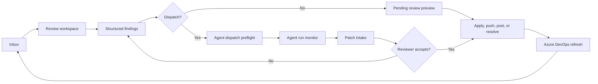
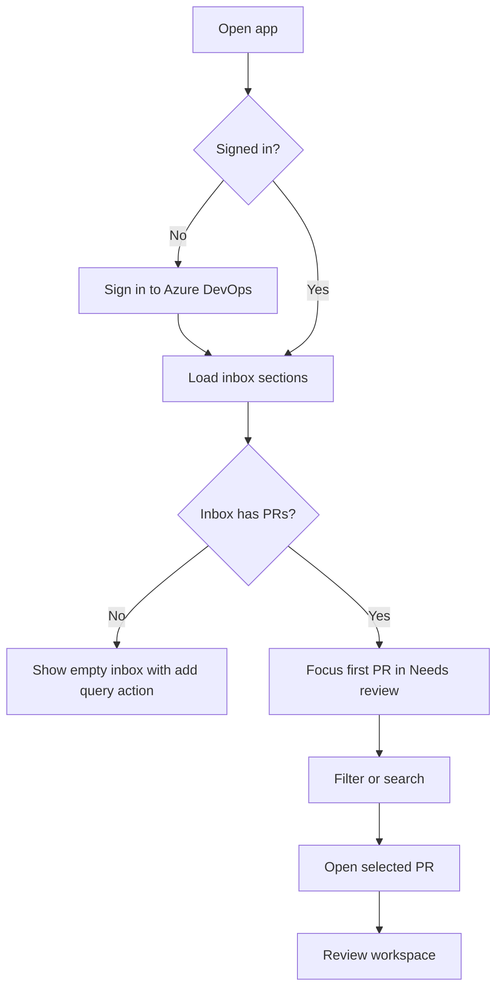
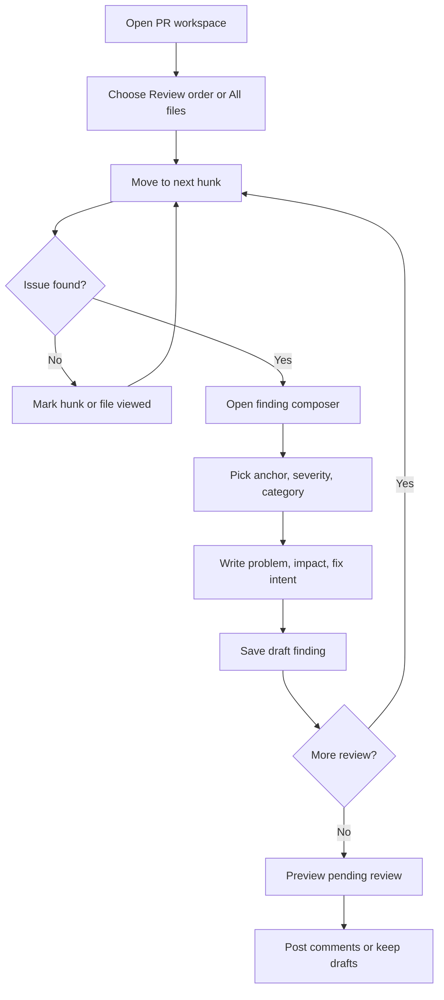
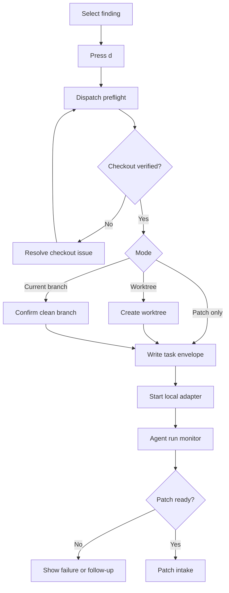
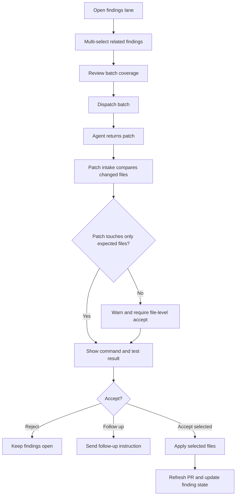
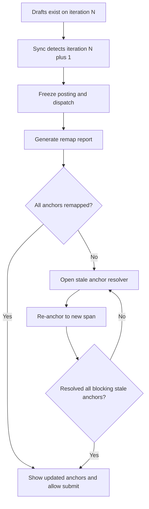
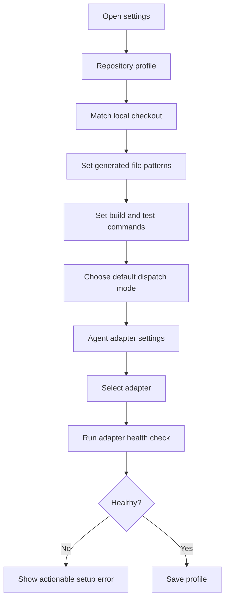
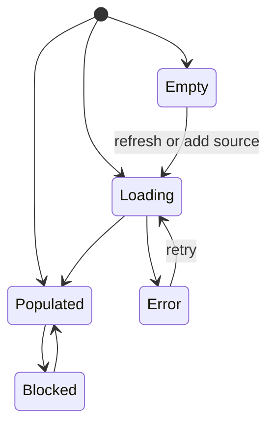

# Design the Azure DevOps review cockpit

> TL;DR: Design a keyboard-first desktop review cockpit that lets Azure DevOps reviewers move from queue triage to anchored findings to local agent fixes without losing focus, source fidelity, or control.

## Problem / Motivation

The product wins only if review feels faster and safer than the browser plus editor plus agent handoff loop.

The behavior spec defines the feature surface: Azure DevOps PR sync, a local review cache, structured findings, local checkout validation, local agent dispatch, patch intake, and reviewer-approved posting or pushing. The UI design makes that surface usable at review speed.

The core UX problem is context fragmentation. Azure Repos owns PR state, the local checkout owns source and tests, and local coding agents own fix execution. The desktop client must keep those together in one keyboard-driven session while preserving Azure DevOps as the system of record.

## Goals

- Reviewers can clear a PR queue with keyboard filtering, triage groups, and persistent read state so that high-volume review does not depend on browser tab management.
- Reviewers can read a PR in a deliberate order, not only file-tree order, so that large changes remain understandable.
- Reviewers can create anchored, structured findings from the diff with minimal focus changes so that comments are precise and agent-ready.
- Reviewers can dispatch one finding or a batch of findings to a local agent through an explicit preflight so that source, branch, adapter, and data boundary are visible before execution.
- Reviewers can inspect patch output, command output, and finding coverage before applying or pushing so that agent output remains reviewer-controlled.
- The full application is reachable and efficient without pointer input so that keyboard-first use is the default, not an accessibility afterthought.

## Non-Goals

- Pixel-perfect Figma frames are out of scope because the host cannot reach Figma. This spec is the canonical tool-agnostic design artifact.
- Replacing Azure DevOps policy, vote, and merge UI is out of scope because Azure DevOps remains the system of record.
- A chat-first agent product is out of scope because the user's primary job is reviewing a PR, not starting an unbounded coding conversation.
- A cloud agent execution surface is out of scope because the behavior spec's wedge is local checkout and local agent dispatch.
- Mobile, tablet, and pointer-first layouts are out of scope because the first release optimizes desktop keyboard review.

## Root cause

N/A: this is the UI/UX design half of a new product specification, not a bug fix.

## Proposal / Design

The experience is a four-lane cockpit: queue, review, findings, and fixes.



The design favors visible state over hidden automation. The reviewer always sees the current PR, current focus scope, current anchor, current finding selection, current checkout state, current agent run, and current submit risk.

### UX benchmark

The category's table stakes are native PR anchors, fast diff traversal, comment status, suggested fixes, PR queues, context-aware findings, and agent fix handoff. The differentiator for this app is not another reviewer bot. It is a local, keyboard-first cockpit that binds Azure DevOps anchors to local agent execution and patch intake.

| Incumbent | Verified UX behavior | Load-bearing quote | Design implication |
|---|---|---|---|
| Azure Repos web PR UI | Browser PR review is the baseline, with file tabs, inline or side-by-side diffs, comments, suggestions, thread status, and votes. | "You can only review Azure DevOps PRs in the web portal by using your browser." [Azure Repos review docs](https://learn.microsoft.com/en-us/azure/devops/repos/git/review-pull-requests?view=azure-devops) | The desktop app must be browser-independent while preserving Azure DevOps comment, status, and vote semantics. |
| Azure Repos web PR UI | Changed-push filtering is a table stake for re-review. | "select one or more changesets from the changes dropdown list" and the diff updates to show only those changesets. [Azure Repos review docs](https://learn.microsoft.com/en-us/azure/devops/repos/git/review-pull-requests?view=azure-devops) | The review workspace needs an Updates lane and a "since last viewed" diff mode. |
| GitHub Copilot code review for Azure Repos | Copilot is an automated reviewer inside Azure Repos, not an approval substitute. | "Copilot acts as an automated reviewer that posts comments and suggestions on changed code" and "It never approves the pull request or requests changes." [Azure Repos Copilot docs](https://learn.microsoft.com/en-us/azure/devops/repos/git/copilot-code-reviews?view=azure-devops) | Imported AI findings should appear as review evidence, not as authority. Human approval remains primary. |
| GitHub Copilot code review | Suggested changes and agent fixes are expected in code review surfaces. | "Copilot's feedback includes suggested changes which you can apply with a couple of clicks" and "click Fix with Copilot." [GitHub Copilot code review docs](https://docs.github.com/en/copilot/how-tos/use-copilot-agents/request-a-code-review/use-code-review) | Findings need a visible suggested-fix or fix-intent lane, plus explicit dispatch and review gates. |
| CodeRabbit | AI review products compete on summaries, categories, severities, and one-click fixes. | "One-click fixes", "AI-generated summaries", "Review types and severity levels." [CodeRabbit overview](https://docs.coderabbit.ai/guides/code-review-overview) | The finding composer must capture category and severity, and the PR overview must summarize what matters first. |
| CodeRabbit Review | A better review UI can reorder changes into logical cohorts and layers with keyboard navigation. | "reorganizes a pull request from a flat file list into a structured, layer-by-layer walkthrough" and shortcuts `J`, `K`, `Z`. [CodeRabbit Review](https://docs.coderabbit.ai/pr-reviews/coderabbit-review) | The file navigator should offer both All files and Review order. Keyboard next/previous must work across logical layers, not only files. |
| CodeRabbit Autofix | Agentic fix tools collect unresolved findings, run verification, and deliver commits or stacked PRs. | "scans unresolved review threads", "runs a repository setup + build verification step", and "pushes a commit" or "opens a stacked PR." [CodeRabbit Autofix](https://docs.coderabbit.ai/finishing-touches/autofix.md) | Patch intake must show which findings were included, which commands ran, and where the result will land before apply or push. |
| CodeRabbit CLI | Local review and agent handoff exist in the CLI category. | "Review code as you write it" and "send the full context directly to your AI coding agent." [CodeRabbit CLI](https://docs.coderabbit.ai/cli/index.md) | The desktop app should keep local workflows visible, not hide them behind web-only controls. |
| Qodo | Enterprise AI review emphasizes low-noise findings and organizational standards. | "Instead of flooding reviews with minor or cosmetic feedback" and findings explain "What needs attention", "Why it matters", and "How to move forward." [Qodo code review](https://docs.qodo.ai/code-review.md) | Finding cards should force concise problem, impact, and fix intent fields. Noise controls belong in filters and repository profiles. |
| Qodo Context Engine | Context matters beyond the changed lines. | Reviews need "Repository-level context", "Cross-file relationships", and "Historical implementation patterns." [Qodo Context Engine](https://docs.qodo.ai/core-concepts/context-engine.md) | The UX needs related-context drawers, but it must keep diff reading as the center of gravity. |
| Greptile | Fix handoff to local agents is a market signal. | "Every Greptile review comment includes a Fix with your Agent button" and sends "file paths, line numbers, the comment, and the suggested fix." [Greptile Fix with your Agent](https://www.greptile.com/docs/integrations/fix-with-your-agent) | Dispatch must preserve anchors, comments, suggested fix intent, and file spans in the task envelope. |
| Greptile | Batch fixing is expected for multiple findings. | "A Fix All button in the review summary sends every issue at once." [Greptile key features](https://www.greptile.com/docs/code-review/key-features) | The findings lane needs multi-select and batch dispatch with a coverage checklist. |
| Graphite | PR inbox sections and fuzzy search are table stakes for queue work. | "Needs your review", "Returned to you", "Drafts", "Waiting for review" and `cmd + k` search. [Graphite PR Inbox](https://graphite.com/docs/use-pr-inbox) | The app starts at an inbox with saved sections, not directly at a PR URL field. |
| Graphite Agents | Agent updates can be launched from PR pages, but they are cloud and author-oriented. | "Click Agent on the right side of the PR" and "Agents is available only to PR authors." [Graphite docs](https://graphite.com/docs/llms-full.txt) | This app should make reviewer-side Patch-only and Worktree modes first-class, not only author branch commits. |
| Ellipsis | Review bots compete on confidence, learning, rules, quiet mode, and path ignores. | "confidence score", "learn from your feedback", "Rules can apply only to certain files", and "Quiet Mode." [Ellipsis code review](https://docs.ellipsis.dev/features/code-review) | The findings and rules UI needs confidence, feedback, path scope, and noise controls. |
| Ellipsis bug fixes | Comment-to-code workflows are expected. | "Transform comments on pull requests into working, tested code" and "accept the commit directly from the GitHub UI." [Ellipsis bug fixes](https://docs.ellipsis.dev/features/bug-fixes) | Patch acceptance must be a designed surface, not a raw Git operation. |
| Microsoft CodeFlow | Client-side review performance is a proven UX advantage. | "download your change first and then interact with it, which makes switching between files and different regions very, very fast." [CodeFlow paper PDF](https://cabird.com/pdfs/codeflow2018.pdf) | The desktop client should cache PR state and keep keyboard navigation independent from network latency. |

### UX table stakes and differentiators

| Category | Table stakes | This design's answer |
|---|---|---|
| PR queue | Saved sections, fuzzy search, assignment state, unread changes | Inbox groups, command palette search, local read state |
| Review reading | File tree, side-by-side and inline diff, changed-push filter, viewed state | Review order lane, All files lane, Updates filter, persistent cursor |
| Commenting | Line, range, file, and PR comments with thread status | Structured finding composer with anchor preview and Azure DevOps state |
| AI review | Severity, category, confidence, low-noise filters | Finding cards with severity, category, source, confidence, and dispatch state |
| Agent fix | Single and batch fix handoff | Local preflight, task envelope preview, run monitor, patch intake |
| Trust | Review before commit or push | Untrusted patch rendering, test output, changed-file list, explicit apply and push |
| Speed | Keyboard navigation, local cache, no context switching | Global key model, virtualized diff, local session store |
| Accessibility | Keyboard, focus visibility, screen-reader semantics | Roving focus, named regions, live status, non-color signals |

### Primary user and jobs

The primary user is a senior engineer or PR owner who reviews Azure DevOps PRs and uses local agents to fix selected findings.

| Job | What the user is trying to do | Design obligation |
|---|---|---|
| Clear the queue | Find which PR needs attention next | Show grouped inbox state, unread deltas, blockers, and saved filters. |
| Understand the change | Read the PR in a useful order | Offer Review order, All files, changed-push filters, summaries, and persistent viewed state. |
| Leave precise feedback | Comment on a line, range, file, or PR | Keep the anchor visible while composing; capture severity, category, expected behavior, and fix intent. |
| Hand off fixable work | Ask a local agent to fix selected findings | Make checkout, branch, adapter, run directory, and data boundary explicit before dispatch. |
| Audit agent output | Decide whether a patch is safe | Show diff, commands, tests, claimed finding coverage, and conflicts before apply or push. |
| Recover from change | Re-review after new commits or force-pushes | Keep snapshots, stale anchor states, remap paths, and block unsafe submission. |

### Key flows

#### Flow 1: Triage the PR queue



Flow design: the inbox is the first screen. It makes queue status and the next action obvious before any diff is opened.

#### Flow 2: Review and comment without an agent



Flow design: comment drafting never hides the diff anchor. Preview is mandatory before remote write.

#### Flow 3: Dispatch one finding to a local agent



Flow design: dispatch is fast after setup, but never silent. The preflight is the trust surface.

#### Flow 4: Batch findings into one fix and intake patch



Flow design: batch fixing is selection-first. Patch intake records partial acceptance instead of treating a patch as all-or-nothing.

#### Flow 5: Handle a stale PR during review



Flow design: stale state blocks remote writes, not local reading. The user sees exactly which anchors moved.

#### Flow 6: Configure repository profile and adapter



Flow design: setup turns future dispatch into a one-screen confirmation, while exposing data boundary and local command behavior.

### Screen and surface inventory

The inventory covers every flow and includes persistent overlays because keyboard-first products need predictable focus targets for transient states.

| # | Surface | Purpose | Primary flow coverage |
|---|---|---|---|
| 1 | Sign-in and organization picker | Connect Azure DevOps identity and choose default organization. | 1 |
| 2 | Inbox | Show PR queue sections, saved filters, unread deltas, policy state, and dispatch eligibility. | 1 |
| 3 | Inbox filter builder | Create or edit saved sections by project, repo, author, branch, status, and query. | 1 |
| 4 | PR overview | Show title, reviewers, vote, policy state, summary, updates, and unresolved threads before diff reading. | 2, 5 |
| 5 | Review workspace shell | Hold navigator, diff, findings, and context panels with stable keyboard lanes. | 2, 3, 4, 5 |
| 6 | Review order navigator | List cohorts, layers, files, hunks, viewed state, and comments. | 2 |
| 7 | All files navigator | Let users jump by path, status, viewed state, generated marker, and comment count. | 2 |
| 8 | Diff viewer | Render side-by-side, inline, and focused hunk views with anchorable spans. | 2, 3, 4, 5 |
| 9 | Thread drawer | Show Azure DevOps threads, status, replies, and filters. | 2, 5 |
| 10 | Finding composer | Capture anchored problem, severity, category, expected behavior, and fix intent. | 2, 3 |
| 11 | Findings lane | Show draft, posted, dispatched, patch-ready, accepted, rejected, stale, and resolved findings. | 2, 3, 4, 5 |
| 12 | Pending review preview | Review comments, suggested changes, thread updates, and vote before posting. | 2, 5 |
| 13 | Dispatch preflight | Verify checkout, branch, head, dirty state, adapter, mode, and data boundary. | 3, 4 |
| 14 | Checkout picker and worktree setup | Match local repository, choose branch or isolated worktree, and resolve dirty state. | 3, 4, 6 |
| 15 | Agent run monitor | Show run state, prompt envelope summary, logs, command status, cancellation, and follow-up. | 3, 4 |
| 16 | Patch intake | Show returned patch, changed files, finding coverage, conflicts, and accept or reject actions. | 3, 4 |
| 17 | Command output and tests panel | Show local command results tied to a finding or patch. | 3, 4 |
| 18 | Stale anchor resolver | Remap stale findings and drafts after new PR iterations. | 5 |
| 19 | Repository profile settings | Configure checkout, generated files, build commands, tests, default mode, and retention. | 6 |
| 20 | Agent adapter settings | Configure local adapter command, capabilities, network declaration, and health check. | 6 |
| 21 | Command palette | Discover commands, key bindings, focus scopes, and action preconditions. | 1, 2, 3, 4, 5, 6 |
| 22 | Empty, loading, error, and blocked overlays | Give every pane a reachable state with retry, details, and next action. | 1, 2, 3, 4, 5, 6 |

### Interaction model

The application uses a pane-first keyboard model with roving focus inside each pane and a command palette for discovery.

#### Focus scopes

| Scope | Purpose | Entry key | Internal movement | Exit key |
|---|---|---|---|---|
| Inbox | PR queue rows and section headers | `g i` | `j`, `k`, `h`, `l`, `/` | `Esc`, `Enter` |
| Navigator | Review order, All files, and Updates | `g f` | `j`, `k`, `Enter`, `Space` | `Esc`, `g d` |
| Diff | Hunks, lines, anchors, comments | `g d` | `j`, `k`, `n`, `N`, `[` , `]` | `Esc`, `g f`, `g c` |
| Threads | Azure DevOps threads and replies | `g t` | `j`, `k`, `r`, `x` | `Esc` |
| Findings | Structured findings and dispatch selection | `g n` | `j`, `k`, `Space`, `d` | `Esc` |
| Agent runs | Run list, logs, and patch entry | `g a` | `j`, `k`, `Enter`, `x` | `Esc` |
| Command palette | Global command search | `Ctrl+K` | Type, arrows, `Enter` | `Esc` |

#### Global key bindings

| Key | Action |
|---|---|
| `Ctrl+K` | Open command palette. |
| `/` | Search active scope. |
| `?` | Show shortcut reference for active scope. |
| `g i` | Go to inbox. |
| `g o` | Go to PR overview. |
| `g f` | Go to navigator. |
| `g d` | Go to diff. |
| `g t` | Go to threads. |
| `g n` | Go to findings. |
| `g a` | Go to agent runs. |
| `j` / `k` | Move to next or previous item in active scope. |
| `n` / `N` | Move to next or previous unreviewed item. |
| `Enter` | Open or activate selection. |
| `Space` | Toggle selection in multi-select scopes. |
| `c` | Create finding or comment at current anchor. |
| `r` | Reply to selected thread. |
| `d` | Dispatch selected finding or findings. |
| `p` | Open pending review preview. |
| `s` | Submit approved remote writes from preview. |
| `v` | Toggle viewed state for current file or hunk. |
| `z` | Toggle focus mode for the diff. |
| `Esc` | Close transient surface or return focus to owning pane. |

#### Selection model

- Single selection is a focused row, hunk, line, thread, finding, run, or file.
- Multi-selection exists only in findings, files, and patch changed-file lists. `Space` toggles membership; `Shift+j` and `Shift+k` extend ranges.
- The status bar always names the active scope, selection count, and next safe action.
- Remote-write actions open a preview first. `s` submits only from the preview surface.
- Destructive local actions, such as discarding an agent patch, use a confirm row in the owning surface rather than a modal when possible.

#### Empty, loading, error, and blocked states



| State | Required content | Required action |
|---|---|---|
| Empty | What is empty, why it can be empty, and the first setup action. | Add query, connect org, attach checkout, or clear filter. |
| Loading | Skeleton rows, source being loaded, cancellation when long-running. | Keep prior content visible when refresh is incremental. |
| Error | Human-readable failure, technical details expander, retry, copy diagnostics. | Retry, sign in, reconnect, or open settings. |
| Blocked | The invariant that blocks the action and the exact fix path. | Resolve checkout, re-anchor stale draft, select adapter, clean worktree. |

### Wireframes

Wireframes use labelled regions and focus order. `F1`, `F2`, and later labels define tab or `g`-key focus order, not visual priority.

#### Inbox, populated

```text
┌────────────────────────────────────────────────────────────────────────────┐
│ Armature Review                                                Ctrl+K  ?   │
├───────────────┬────────────────────────────────────────────────────────────┤
│ F1 Sections   │ F2 Inbox: Needs review                         / filter    │
│ ▸ Needs review│ ┌────────────────────────────────────────────────────────┐ │
│   Returned    │ │ > PR 4218  Review checkout validator        12 files  │ │
│   Waiting     │ │   repo: Tools  author: Mira  updated: 8m    3 threads │ │
│   Drafts      │ │   policy: pending  agent: eligible          unread +2 │ │
│   Failed      │ ├────────────────────────────────────────────────────────┤ │
│               │ │   PR 4211  Replace retry backoff            4 files   │ │
│ F3 Saved      │ │   repo: API    author: Sanjay policy: green  viewed    │ │
│ + Add section │ └────────────────────────────────────────────────────────┘ │
│               │ F4 Preview                                                │
│               │ Title, summary, reviewers, policy, last update             │
├───────────────┴────────────────────────────────────────────────────────────┤
│ F5 Status: Inbox scope, 2 PRs, Enter opens, / filters, ? shortcuts          │
└────────────────────────────────────────────────────────────────────────────┘
```

#### Inbox states

```text
Empty:    "No PRs match Needs review"  [Clear filter] [Edit section] [Refresh]
Loading:  Keep prior rows dimmed, show "Refreshing Azure DevOps, 4 repositories"
Error:    "Could not load PRs" [Retry] [Sign in] [Details] [Copy diagnostics]
Blocked:  "Organization not selected" [Choose organization]
```

#### Review workspace

```text
┌────────────────────────────────────────────────────────────────────────────┐
│ PR 4218 Review checkout validator       policy: pending   vote: not set    │
│ repo Tools  source users/mira/validator  target main      updated +2       │
├───────────────┬───────────────────────────────────────┬────────────────────┤
│ F1 Navigator  │ F2 Diff                               │ F3 Findings        │
│ Tabs: Order   │ file: src/CheckoutValidator.cs        │ Drafts 2           │
│       Files   │ view: side-by-side   since: last view │ Posted 1           │
│       Updates │ ┌───────────────┬───────────────────┐ │ Patch ready 0      │
│               │ │ old           │ new               │ │                    │
│ > Layer 1     │ │ 120 if (...)  │ 120 if (...)      │ │ > should fix       │
│   Contracts   │ │ 121 return    │ 121 throw ...     │ │   correctness      │
│   3 files     │ │               │ 122 ...           │ │   Checkout null    │
│               │ └───────────────┴───────────────────┘ │   d dispatch       │
│ ▸ file A      │ F4 Anchor bar: line 121, c comment     │                    │
│   hunk 1      │ F5 Inline summary and context drawer   │ F6 Threads tab     │
├───────────────┴───────────────────────────────────────┴────────────────────┤
│ Status: Diff scope, next unreviewed n, create finding c, dispatch d         │
└────────────────────────────────────────────────────────────────────────────┘
```

#### Review workspace focus mode

```text
┌────────────────────────────────────────────────────────────────────────────┐
│ PR 4218  Focus mode: Diff only                              z exit focus   │
├────────────────────────────────────────────────────────────────────────────┤
│ F1 Diff                                                                     │
│ ┌────────────────────────────────────┬───────────────────────────────────┐ │
│ │ old                                │ new                               │ │
│ │ ...                                │ ...                               │ │
│ │ 121 return false                   │ 121 throw new InvalidOperation... │ │
│ └────────────────────────────────────┴───────────────────────────────────┘ │
│ F2 Anchor actions: c finding, v viewed, o open in editor, ? shortcuts       │
└────────────────────────────────────────────────────────────────────────────┘
```

#### Finding composer

```text
┌────────────────────────────────────────────────────────────────────────────┐
│ New finding at CheckoutValidator.cs:121-124                         Esc    │
├────────────────────────────────────────────────────────────────────────────┤
│ F1 Anchor preview                                                           │
│  file span: src/CheckoutValidator.cs lines 121-124  [Change anchor]         │
│                                                                            │
│ F2 Severity             F3 Category                                         │
│  ( ) blocking            (x) correctness  ( ) security  ( ) performance     │
│  (x) should fix          ( ) tests        ( ) compatibility                 │
│  ( ) suggestion                                                              │
│                                                                            │
│ F4 Title                                                                    │
│  Checkout validation throws after matching a missing local repo              │
│                                                                            │
│ F5 Body                                                                     │
│  Problem, impact, expected behavior. Markdown supported.                    │
│                                                                            │
│ F6 Fix intent                                                               │
│  Tell the agent or author what change should be made, not exact code.       │
│                                                                            │
│ F7 Actions: [Save draft] [Post comment] [Dispatch...] [Cancel]              │
└────────────────────────────────────────────────────────────────────────────┘
```

#### Dispatch preflight

```text
┌────────────────────────────────────────────────────────────────────────────┐
│ Dispatch 1 finding to local agent                                      Esc │
├────────────────────────────────────────────────────────────────────────────┤
│ F1 Finding                                                                 │
│  should fix, correctness, Checkout validation throws after missing repo      │
│                                                                            │
│ F2 Checkout checks                                                          │
│  ✓ Remote matches Azure DevOps repository                                   │
│  ✓ Local head matches PR iteration 7                                        │
│  ! Working tree has 2 unrelated edits             [Use worktree] [Details]  │
│                                                                            │
│ F3 Mode                                                                     │
│  ( ) Patch only   (x) Worktree   ( ) Current branch                         │
│                                                                            │
│ F4 Adapter                                                                  │
│  Copilot CLI local adapter                                                  │
│  data boundary: local process, network declared by adapter                  │
│  command: copilot agent run --task <task-envelope>                          │
│                                                                            │
│ F5 Task envelope preview                                                    │
│  repository, PR id, file span, severity, fix intent, constraints            │
│                                                                            │
│ F6 Actions: [Dispatch] [Save task file] [Edit settings] [Cancel]            │
└────────────────────────────────────────────────────────────────────────────┘
```

#### Agent run monitor

```text
┌────────────────────────────────────────────────────────────────────────────┐
│ Agent run finding-1234                                      running 02:14  │
├───────────────┬────────────────────────────────────────────────────────────┤
│ F1 Run list   │ F2 Current run                                             │
│ > running     │  State: running                                            │
│   patch ready │  Mode: Worktree                                            │
│   failed      │  Worktree: C:\src\repo\.worktrees\pr-4218-finding-1234     │
│               │                                                            │
│               │ F3 Log                                                     │
│               │  20:57 wrote task envelope                                 │
│               │  20:58 agent started                                       │
│               │  20:59 running tests                                       │
│               │                                                            │
│               │ F4 Actions: [Cancel] [Open run dir] [Copy log]             │
└───────────────┴────────────────────────────────────────────────────────────┘
```

#### Patch intake

```text
┌────────────────────────────────────────────────────────────────────────────┐
│ Patch intake for run finding-1234                         patch ready      │
├───────────────┬───────────────────────────────────────┬────────────────────┤
│ F1 Files      │ F2 Patch diff                         │ F3 Coverage        │
│ > Validator.cs│ ┌───────────────┬───────────────────┐ │ ✓ finding-1234     │
│   Tests.cs    │ │ before        │ after             │ │ ? finding-1235     │
│ ! Extra.cs    │ │ ...           │ ...               │ │                    │
│               │ └───────────────┴───────────────────┘ │ F4 Commands        │
│               │                                       │ ✓ build 0          │
│               │                                       │ x tests 1          │
│               │                                       │ [View output]      │
├───────────────┴───────────────────────────────────────┴────────────────────┤
│ F5 Actions: [Accept selected] [Accept all expected] [Follow up] [Reject]    │
└────────────────────────────────────────────────────────────────────────────┘
```

#### Stale anchor resolver

```text
┌────────────────────────────────────────────────────────────────────────────┐
│ Stale anchors after iteration 8                                      Esc   │
├───────────────┬────────────────────────────────────────────────────────────┤
│ F1 Drafts     │ F2 Remap candidate                                        │
│ > stale 1     │  Old: CheckoutValidator.cs:121-124                         │
│   remapped 2  │  New candidates:                                           │
│               │  > CheckoutValidator.cs:130-133  similarity high           │
│               │    RepositoryMatcher.cs:88-90     similarity low            │
│               │                                                            │
│               │ F3 Actions: [Accept candidate] [Pick span in diff]          │
│               │             [Convert to PR comment] [Delete draft]          │
└───────────────┴────────────────────────────────────────────────────────────┘
```

#### Repository profile and adapter settings

```text
┌────────────────────────────────────────────────────────────────────────────┐
│ Settings: Repository profile                                      Ctrl+K   │
├───────────────┬────────────────────────────────────────────────────────────┤
│ F1 Settings   │ F2 Repository profile                                      │
│ > Repository  │  Checkout path: C:\src\repo                  [Change]      │
│   Adapter     │  Generated patterns: **/*.g.cs, dist/**       [Edit]        │
│   Shortcuts   │  Build command: bm repo.slnf                 [Test]         │
│   Retention   │  Test command: vstest ...                    [Test]         │
│               │  Default dispatch: Worktree                                 │
│               │                                                            │
│               │ F3 Adapter summary                                         │
│               │  Copilot CLI local adapter       health: ok    [Configure]  │
│               │                                                            │
│               │ F4 Actions: [Save] [Run health check] [Reset]               │
└───────────────┴────────────────────────────────────────────────────────────┘
```

### Visual design system

The visual system is quiet, dense, and status-forward. It should feel closer to an editor than a dashboard.

#### Color roles

| Token | Light intent | Dark intent | Usage |
|---|---|---|---|
| `color.canvas.default` | `#F8F8F8` | `#1E1E1E` | App background. |
| `color.canvas.panel` | `#FFFFFF` | `#252526` | Panes, cards, drawers. |
| `color.canvas.raised` | `#F3F6FA` | `#2D2D30` | Selected or raised surfaces. |
| `color.text.primary` | `#1F1F1F` | `#F2F2F2` | Primary text. |
| `color.text.secondary` | `#5F6368` | `#C8C8C8` | Metadata and captions. |
| `color.text.muted` | `#7A7A7A` | `#8A8A8A` | Disabled or low-priority metadata. |
| `color.border.default` | `#D0D7DE` | `#3C3C3C` | Pane and row borders. |
| `color.border.focus` | `#0F6CBD` | `#4CC2FF` | Visible keyboard focus ring. |
| `color.accent.primary` | `#0F6CBD` | `#4CC2FF` | Primary action, active tab, active anchor. |
| `color.status.success` | `#107C10` | `#6CCB5F` | Passing checks, accepted patch. |
| `color.status.warning` | `#A15C00` | `#F7C948` | Dirty tree, stale but recoverable anchors. |
| `color.status.danger` | `#C50F1F` | `#FF6B6B` | Blocking risk, failed tests, rejected patch. |
| `color.status.info` | `#005A9E` | `#7CC7FF` | Running sync, agent in progress. |
| `color.diff.added.bg` | `#E6FFEC` | `#12361D` | Added lines. |
| `color.diff.removed.bg` | `#FFEBE9` | `#3A1518` | Removed lines. |
| `color.diff.modified.bg` | `#FFF8C5` | `#3A3108` | Changed lines and remap candidates. |
| `color.finding.blocking` | `#C50F1F` | `#FF6B6B` | Blocking severity badge. |
| `color.finding.shouldFix` | `#A15C00` | `#F7C948` | Should-fix severity badge. |
| `color.finding.suggestion` | `#0F6CBD` | `#4CC2FF` | Suggestion badge. |
| `color.finding.question` | `#5C2D91` | `#C586C0` | Question badge. |

#### Type scale

| Token | Size | Weight | Usage |
|---|---:|---:|---|
| `type.family.ui` | system UI | regular | Labels, buttons, metadata. |
| `type.family.mono` | monospace | regular | Code, paths, commands, line numbers. |
| `type.size.caption` | 11 px | 400 | Counts, shortcut hints, timestamps. |
| `type.size.body` | 13 px | 400 | Rows, comments, settings text. |
| `type.size.bodyStrong` | 13 px | 600 | Row titles and field labels. |
| `type.size.code` | 12 px | 400 | Diff and logs. |
| `type.size.headingSmall` | 15 px | 600 | Pane headings. |
| `type.size.heading` | 18 px | 600 | Screen headings. |
| `type.size.title` | 22 px | 600 | First-run and empty-state titles. |

#### Spacing and layout tokens

| Token | Value | Usage |
|---|---:|---|
| `space.1` | 4 px | Icon to label gap, dense row padding. |
| `space.2` | 8 px | Standard internal spacing. |
| `space.3` | 12 px | Row padding, field grouping. |
| `space.4` | 16 px | Pane padding. |
| `space.6` | 24 px | Section separation. |
| `space.8` | 32 px | Empty-state and dialog rhythm. |
| `radius.sm` | 4 px | Badges and small controls. |
| `radius.md` | 6 px | Cards, inputs, menu items. |
| `stroke.focus` | 2 px | Keyboard focus ring. |
| `pane.nav.width` | 280 px | Left navigator. |
| `pane.side.width` | 360 px | Findings, threads, context. |
| `row.height.compact` | 28 px | Dense lists. |
| `row.height.default` | 40 px | Inbox and findings rows. |

#### Core components

| Component | Required behavior |
|---|---|
| `AppShell` | Owns top status, pane layout, command routing, and global shortcuts. |
| `Pane` | Has a visible heading, region label, keyboard entry command, scroll state, and empty or error state. |
| `ListRow` | Supports focused, selected, read, unread, disabled, and blocked states. |
| `DiffLine` | Exposes line number, side, change type, anchor state, comments, and selection. |
| `FindingCard` | Shows severity, category, title, anchor, source, dispatch state, and next action. |
| `StatusBadge` | Uses icon, text, and color. Color alone never carries meaning. |
| `CommandPalette` | Searches commands and entities; shows key binding and disabled reason. |
| `Composer` | Markdown text area with anchor preview, required field errors, and submit preview path. |
| `PreflightCheckList` | Shows pass, warning, fail, and blocked rows with corrective action. |
| `PatchFileRow` | Shows file status, expected or unexpected marker, coverage count, and selection. |
| `Toast` | Announces completed background work and points to the owning pane. |
| `InlineBanner` | Blocks unsafe actions inside the affected pane, not at app level. |

### Accessibility model

Accessibility is part of the core interaction design. A reviewer must be able to complete all key flows without pointer input, color perception, or visual-only diff cues.

| Area | Requirement |
|---|---|
| Keyboard reachability | Every command in the flows has a key path. No action requires hover. |
| Focus visibility | Focus uses `color.border.focus`, 2 px minimum stroke, and a non-color shape change. |
| Focus order | `g` shortcuts move between major regions; Tab moves through actionable controls inside a transient surface; `Esc` returns to the owner. |
| Screen-reader regions | App shell, inbox, navigator, diff, findings, threads, agent runs, and status bar expose named regions. |
| Diff semantics | Each diff line announces file, side, line number, change type, and comment count. Added, removed, and modified states use text and icons as well as color. |
| Finding semantics | Finding cards announce severity, category, title, anchor, dispatch state, and whether action is available. |
| Live updates | Sync, agent run state, patch ready, stale anchor, and post success use polite live regions. Blocking failures use assertive live regions only when they stop the current action. |
| Contrast intent | Text and essential icons target WCAG 2.2 AA contrast. Focus rings, diff backgrounds, and status badges are checked in light, dark, and high-contrast themes. |
| Reduced motion | Pane transitions, loading shimmer, and patch-ready animations respect reduced-motion settings. |
| Error recovery | Error states expose Retry, Details, and Copy diagnostics controls in that order. |
| Shortcut conflicts | Key bindings are remappable. The app ships a searchable shortcut reference and supports disabling single-key shortcuts while text entry is active. |
| Pointer parity | Pointer users can use the same commands through visible buttons, context menus, and row actions. Keyboard remains the design baseline. |

### Reconciliation: features to add to the behavior spec

The design depends on a few behaviors that are implied by the current behavior spec but should be explicit before implementation.

| Feature | Why the design needs it | Suggested behavior-spec addition |
|---|---|---|
| Logical review order | CodeRabbit Review shows that ordered cohorts and layers are a competitive UX for large PRs. | Add a `ReviewOrder` model that can group files and hunks into cohorts, layers, and All files fallback. |
| Command palette | Keyboard-first UX needs discoverability and disabled-reason display. | Add a command registry with command id, label, key binding, focus scope, and preconditions. |
| Shortcut customization | Accessibility and enterprise users need key conflict mitigation. | Add user settings for keymap presets, single-key shortcut toggle, and remapping. |
| Adapter health check | Dispatch preflight needs a typed healthy or blocked state before execution. | Add adapter health check result with version, command, capabilities, data boundary, and setup errors. |
| Finding confidence and source | Imported AI findings from incumbents carry confidence or source metadata. | Add optional `confidence` and `source` fields to `Finding`. |
| Patch unexpected-file classification | Patch intake needs to highlight files outside selected findings. | Add expected-file set and changed-file classification to agent result intake. |
| Screen-reader diff metadata | Accessible diff review needs semantic line metadata, not only visual markup. | Add accessibility requirements to diff model and renderer. |

### API / Interface surface

This design does not change the behavior spec's external APIs. It adds UI-facing view models that implementation should expose to the shell.

```text
CommandDescriptor
  id: string
  label: string
  keyBinding: string?
  scope: FocusScope
  enabled: bool
  disabledReason: string?
```

```text
ReviewOrderNode
  id: string
  kind: Cohort | Layer | File | Hunk
  label: string
  fileCount: int?
  commentCount: int
  viewedState: Unviewed | PartlyViewed | Viewed
  children: ReviewOrderNode[]
```

```text
PatchIntakeFile
  path: string
  status: Added | Modified | Deleted | Renamed
  expected: bool
  coveredFindingIds: string[]
  selectedForApply: bool
  conflictState: None | StaleBase | ApplyConflict
```

### Implementation notes

UI implementation should keep input responsive when network, Git, diff rendering, or agent work is slow.

| Concern | Design requirement |
|---|---|
| Local cache | Navigation reads from local state first, then reconciles with Azure DevOps. |
| Virtualization | Inbox rows, file tree rows, diff hunks, log lines, and patch files render virtually. |
| Command routing | Commands resolve through active focus scope, then global scope. Disabled commands explain why in the palette. |
| Remote writes | Comment posting, thread updates, votes, pushes, and resolves route through preview surfaces. |
| Background work | Sync and agent runs update owning panes and status bar. They do not steal focus. |
| Stale state | New PR iterations block submit and dispatch for affected findings until remap or conversion. |
| Persistence | Read state, drafts, key bindings, pane sizes, filters, and run records persist per user. |

## Alternatives considered

| Alternative | What it is | Why rejected |
|---|---|---|
| Do nothing | Use Azure DevOps web, an editor, and a separate local agent session. | The user still copies context between PR, local checkout, and agent, which is the product gap. |
| Browser clone | Recreate Azure DevOps Files and Overview tabs in a desktop wrapper. | It preserves familiar UI but misses the local-agent wedge and keyboard review order. |
| Chat-first interface | Start with an agent chat and attach PR context. | Reviewers need anchored reading, pending review preview, and patch audit before open-ended chat. |
| IDE extension first | Put all surfaces inside VS Code or Visual Studio. | IDEs are strong for editing, but the behavior spec's first job is queue review across PRs and repositories. |
| Agent-first automation | Let the agent review and fix by default, then show results. | The product promise is reviewer-controlled review. Agent output is untrusted until inspected. |
| Mouse-first dashboard | Use rich cards, drag-and-drop sections, and pointer controls. | The app brief and main differentiator require keyboard speed and predictable focus. |
| Minimal CLI | Build only commands for inbox, comment, dispatch, and apply. | CLI speed is useful, but rich diff review, stale anchors, and patch intake need a visual layout. |

## Risks / blast radius

| Risk | Severity (H/M/L) | Mitigation |
|---|---|---|
| Keyboard model is powerful but undiscoverable | H | Ship command palette, active-scope status bar, shortcut reference, and visible button parity. |
| Agent patch looks safer than it is | H | Treat patch as untrusted, show unexpected files, test output, and require explicit apply or push. |
| Stale anchors post to the wrong line | H | Track iteration per finding, block remote writes for stale anchors, and require resolver completion. |
| Accessibility regressions hide in custom diff UI | H | Test screen-reader line announcements, focus order, contrast, high contrast, and keyboard-only flows. |
| Large PRs become slow | M | Virtualize lists and diffs, cache local state, and keep background sync off the input path. |
| Users distrust local adapter execution | M | Show adapter command, data boundary, network declaration, run directory, and retention before dispatch. |
| Multi-select dispatch creates ambiguous fix scope | M | Require batch coverage preview and show selected findings inside task envelope preview. |
| Shortcut conflicts with user tools | M | Support key remapping and a single-key shortcut toggle. |
| Visual density hurts new users | L | Use command palette, preview pane, and progressive disclosure for setup and advanced context. |

## Validation / test plan

Validation must prove that the design is faster, safer, and more accessible than the fragmented baseline for the behavior spec's flows.

| Test type | Scenario | Oracle |
|---|---|---|
| UX source audit | Review every benchmark claim in this spec. | Each load-bearing claim has a quote and URL. |
| Keyboard walkthrough | Complete flows 1 through 6 without pointer input. | Every required action is reachable, visible, and reversible where needed. |
| Screen-reader walkthrough | Complete queue triage, finding creation, dispatch preflight, and patch intake with a screen reader. | Regions, selected rows, diff lines, findings, and live status announce correctly. |
| Stale-anchor usability test | Draft comments, receive a new PR iteration, and resolve stale anchors. | User cannot post to stale spans and can recover each draft. |
| Agent trust test | Dispatch a finding to an adapter that returns expected and unexpected file edits. | Patch intake distinguishes expected and unexpected changes before apply. |
| Large PR performance test | Open a PR with 500 files and 20,000 changed lines. | Keyboard movement remains responsive while diff content streams or virtualizes. |
| Error-state test | Simulate sign-in expiry, Azure DevOps outage, dirty worktree, missing adapter, failed tests, and patch conflict. | Each state shows cause, next action, retry or details, and keeps focus predictable. |
| Contrast and theme test | Check light, dark, and high-contrast themes. | Text, focus, status, and diff signals meet AA intent and do not rely on color alone. |
| Dogfood review | Review a real Azure DevOps PR, dispatch one local fix, inspect patch, and post or push. | Azure DevOps state, local run record, and finding state agree after refresh. |

## Rollout / compatibility

Roll out the UI in layers that match the risk profile.

1. Private preview: inbox, PR overview, review workspace, keyboard navigation, draft findings, and local read state.
2. Team preview: posting comments, pending review preview, stale anchor resolver, repository profiles, and shortcut customization.
3. Agent preview: dispatch preflight, local adapter settings, agent run monitor, patch intake, and retention controls behind a feature flag.
4. Public preview: batch dispatch, logical review order, imported AI findings, high-contrast theme, and accessibility certification.
5. General availability: enterprise policy controls, profile sharing, telemetry settings, and installer packaging.

Compatibility requirements:

- Comments posted by the client remain standard Azure DevOps threads.
- Users can leave the desktop client and continue in Azure DevOps web without losing remote state.
- Existing local drafts, read state, shortcuts, profiles, and run records survive upgrades.
- Agent dispatch can be disabled without disabling normal review.
- Figma rendering can be added later without replacing this tool-agnostic spec.

## Open questions

- [ ] Q1: Which review-order inputs are available in v1: file path heuristics, local code graph, imported AI walkthrough, or manual grouping? Owner: product manager. Resolve by: architecture review.
- [ ] Q2: Which screen reader and high-contrast matrix defines launch readiness? Owner: accessibility lead. Resolve by: accessibility test plan.
- [ ] Q3: Should the default keymap mimic Vim, Graphite and CodeRabbit Review, VS Code, or a custom hybrid? Owner: design lead. Resolve by: usability study.
- [ ] Q4: Which local adapters need first-party setup screens? Owner: agent platform lead. Resolve by: private preview planning.
- [ ] Q5: Should imported AI findings from Copilot, CodeRabbit, Qodo, Greptile, Graphite, or Ellipsis appear in the same Findings lane as human findings? Owner: product manager. Resolve by: competitive strategy review.
- [ ] Q6: What telemetry is permitted for keyboard commands, failed preflights, and patch acceptance? Owner: privacy reviewer. Resolve by: privacy review.

## References

| ID | Source | URL |
|---|---|---|
| Azure Repos review docs | Microsoft Learn, Review and comment on pull requests | <https://learn.microsoft.com/en-us/azure/devops/repos/git/review-pull-requests?view=azure-devops> |
| Azure Repos Copilot docs | Microsoft Learn, Get started with Copilot code review for pull requests | <https://learn.microsoft.com/en-us/azure/devops/repos/git/copilot-code-reviews?view=azure-devops> |
| GitHub Copilot code review docs | GitHub Docs, Using GitHub Copilot code review | <https://docs.github.com/en/copilot/how-tos/use-copilot-agents/request-a-code-review/use-code-review> |
| CodeRabbit overview | CodeRabbit docs, Code review overview | <https://docs.coderabbit.ai/guides/code-review-overview> |
| CodeRabbit Review | CodeRabbit docs, CodeRabbit Review | <https://docs.coderabbit.ai/pr-reviews/coderabbit-review> |
| CodeRabbit Autofix | CodeRabbit docs, Autofix | <https://docs.coderabbit.ai/finishing-touches/autofix.md> |
| CodeRabbit CLI | CodeRabbit docs, Command-Line Review Tool | <https://docs.coderabbit.ai/cli/index.md> |
| Qodo code review | Qodo docs, The Qodo Code Review experience | <https://docs.qodo.ai/code-review.md> |
| Qodo Context Engine | Qodo docs, Understanding the Context Engine | <https://docs.qodo.ai/core-concepts/context-engine.md> |
| Greptile key features | Greptile docs, Key Features | <https://www.greptile.com/docs/code-review/key-features> |
| Greptile Fix with your Agent | Greptile docs, Fix with your Agent | <https://www.greptile.com/docs/integrations/fix-with-your-agent> |
| Graphite PR Inbox | Graphite docs, Pull Request Inbox | <https://graphite.com/docs/use-pr-inbox> |
| Graphite agents and AI review | Graphite docs, llms-full | <https://graphite.com/docs/llms-full.txt> |
| Ellipsis code review | Ellipsis docs, Code Review | <https://docs.ellipsis.dev/features/code-review> |
| Ellipsis bug fixes | Ellipsis docs, Bug Fixes | <https://docs.ellipsis.dev/features/bug-fixes> |
| CodeFlow paper | CodeFlow: Improving the Code Review Process at Microsoft | <https://cabird.com/pdfs/codeflow2018.pdf> |
