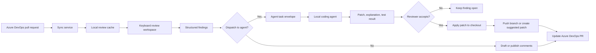

# Build a keyboard-first Azure DevOps review client

> TL;DR: Build a desktop client that lets reviewers move through Azure DevOps pull requests at keyboard speed, capture high-quality findings, and hand selected findings to a local coding agent that prepares fixes in the developer's checkout.

## Problem / Motivation

Azure DevOps pull request review is optimized for web navigation, not for sustained keyboard-driven analysis across large diffs. Reviewers lose time switching between browser tabs, local editors, test output, and agent sessions while trying to keep findings tied to exact file spans.

The highest-value review findings are actionable: a bug, a missing test, a naming mismatch, a security concern, or a correctness issue with a local fix path. Today, the reviewer must either write a detailed comment and wait for the author, or leave the review tool to ask a coding agent to fix the issue in a different context.

The product closes that loop. It turns review findings into structured tasks that a local coding agent can execute against the pull request branch, then brings the resulting patch back into the review workspace for approval.

## Goals

- Reviewers can triage, read, comment on, and submit Azure DevOps pull request reviews without leaving the keyboard so that large review queues cost less attention.
- Review findings carry enough structure, including file span, severity, category, expected behavior, and fix intent, so that humans and agents can act on them without re-asking for context.
- Reviewers can dispatch one or more findings to a local coding agent so that small fixable issues can be corrected while the reviewer remains in flow.
- The client keeps source code, credentials, and agent prompts local except for content that the reviewer explicitly posts back to Azure DevOps so that repository confidentiality remains clear.
- The client records every agent-produced patch, command, and test result so that the reviewer can audit what changed before pushing or commenting.
- The client works with existing Azure DevOps pull requests, branches, policies, and comments so that teams do not need to migrate code hosting or review policy.

## Non-Goals

- Replacing Azure DevOps pull requests is out of scope because Azure DevOps remains the system of record for branches, policies, comments, and merge decisions.
- Fully autonomous review submission is out of scope for the first release because the reviewer must approve comments and agent patches before the client posts or pushes them.
- Cloud-hosted code execution is out of scope because the core promise is local agent execution against the user's checkout.
- Mobile and tablet review are out of scope because the product is keyboard-first and depends on local development tools.
- General issue tracking is out of scope because the client focuses on pull request review and fix dispatch, not backlog management.
- Arbitrary Git provider support is out of scope for the first release because Azure DevOps integration drives the authentication, policy, and comment model.

## Root cause

N/A: this is a new product specification, not a bug fix.

## Proposal / Design

The product is a native desktop review workbench with three loops: review, dispatch, and integrate. The reviewer reads a pull request, creates structured findings, sends selected findings to a local agent, and accepts or rejects the resulting patch before posting or pushing.

### Diagram



### Product model

The application centers on a local workspace that binds four resources:

| Resource | Purpose | Source of truth |
|---|---|---|
| Pull request | Title, description, commits, policies, threads, reviewers | Azure DevOps |
| Local checkout | Files, branch state, build and test commands | User's machine |
| Review session | Read state, filters, draft findings, keyboard history | Local encrypted cache |
| Agent run | Task envelope, command log, patch, result summary | Local run record |

A workspace can attach to one pull request at a time for deep review, while the inbox shows a queue of assigned or watched pull requests. The local checkout is optional for read-only review and required for agent dispatch.

### Core features

#### Pull request inbox

The inbox gives reviewers a queue they can clear with the keyboard.

- Show pull requests assigned to the user, created by the user, explicitly watched, or matching saved queries.
- Group by review state: needs review, waiting on author, failed policy, merge conflict, draft, and ready to complete.
- Surface changed file count, unresolved thread count, policy state, last update time, and reviewer assignment.
- Support saved filters such as repository, team, branch prefix, label, author, and policy status.
- Open the selected pull request into the review workspace with one command.

#### Review workspace

The review workspace optimizes for fast movement through changed code.

- Diff tree with file status, comment count, generated-file marker, and viewed state.
- Unified and side-by-side diff modes with inline, block, and file-level comment anchors.
- Symbol and path jump, fuzzy file search, next finding, next unreviewed file, next thread, and next hunk.
- Review state persistence across restarts, including viewed files, collapsed regions, filters, and cursor position.
- Local file open command that opens the same file and line in the user's configured editor.
- Build and test result panel that can attach local command output to an agent run or finding.

#### Keyboard interaction model

Every primary action MUST be available through the keyboard. Pointer input can exist, but it cannot be required for the main review loop.

| Key pattern | Action |
|---|---|
| `j` / `k` | Move to next or previous hunk, thread, or inbox row based on focus |
| `Enter` | Open selected item |
| `g i` | Go to inbox |
| `g f` | Go to file tree |
| `g d` | Go to diff |
| `g t` | Go to threads |
| `g a` | Go to agent runs |
| `c` | Create comment or finding at the current span |
| `r` | Reply to the selected thread |
| `d` | Dispatch selected finding to the agent |
| `p` | Preview pending comments and patches |
| `s` | Submit approved comments |
| `/` | Search within the pull request |
| `Ctrl+K` | Open command palette |

The command palette is the escape hatch for discoverability. It lists commands, key bindings, scope, and whether a command requires an attached checkout.

#### Structured findings

A finding is a review comment plus machine-readable intent. The reviewer can post it as a normal Azure DevOps comment, dispatch it to an agent, or do both.

A finding includes:

- File path and line range, or pull request level when no file anchor exists.
- Category: correctness, test coverage, security, performance, maintainability, compatibility, product behavior, or style consistency.
- Severity: blocking, should fix, suggestion, or question.
- Expected behavior and observed risk.
- Optional reproduction steps or local command output.
- Suggested fix intent, expressed as a reviewer instruction rather than a patch.
- Dispatch eligibility: local fix, author action, design discussion, or cannot automate.

Findings can be batched. A reviewer can select related findings and dispatch them as one agent task when one code change should address the group.

#### Local agent dispatch

Agent dispatch turns a finding into a bounded local task.

The client MUST require an attached checkout before dispatch. It verifies the checkout remote, branch, commit, and working tree state, then asks the reviewer to choose one execution mode:

| Mode | Behavior | Use case |
|---|---|---|
| Patch only | Agent writes a patch file without modifying the checkout | Reviewer wants maximum isolation |
| Worktree | Client creates a temporary Git worktree for the PR branch and lets the agent edit it | Reviewer wants safe local edits |
| Current branch | Agent edits the currently checked-out branch | Author is reviewing their own PR |

The client sends the agent a task envelope over a local adapter. The first adapters should support CLI process execution and stdio JSON because those work with local agents without requiring a resident service.

```json
{
  "schemaVersion": "1.0",
  "taskId": "finding-1234",
  "repositoryPath": "C:\\src\\repo",
  "pullRequest": {
    "organization": "contoso",
    "project": "App",
    "repository": "Service",
    "id": 42,
    "sourceBranch": "users/alex/fix-null-state",
    "targetBranch": "main",
    "headCommit": "abcdef"
  },
  "findings": [
    {
      "filePath": "src/Reviewer/State.cs",
      "lineStart": 120,
      "lineEnd": 128,
      "severity": "shouldFix",
      "category": "correctness",
      "instruction": "Handle the null review state before reading the reviewer id.",
      "expectedBehavior": "A pull request with no assigned reviewer opens without throwing."
    }
  ],
  "constraints": {
    "mayRunTests": true,
    "mayCommit": false,
    "mayPush": false
  }
}
```

The agent returns a result envelope with a patch, changed-file list, explanation, commands run, command exit codes, and open questions. The client never trusts the result blindly. It renders the diff, shows command output, and requires reviewer approval before applying, committing, pushing, or posting a comment.

#### Patch intake and review

Patch intake is a second review pass, not an automatic apply step.

- Show the agent patch as a diff against the selected execution mode's base.
- Mark which findings the patch claims to address.
- Let the reviewer accept all, accept selected files, reject all, or send a follow-up instruction to the same agent run.
- Detect conflicts with new pull request commits and require a rebase or rerun before applying stale patches.
- Record the accepted patch as linked evidence on the finding and agent run.
- Convert the finding to a posted comment, a resolved thread, or a local note based on reviewer choice.

#### Azure DevOps integration

The client uses Azure DevOps as the source of truth for pull request state.

- Sign in with Microsoft Entra ID through a browser or device flow. Personal access token support SHOULD exist for environments that block browser sign-in.
- Read pull request metadata, changed files, iterations, threads, reviewers, policies, and build links.
- Post new comments, replies, and thread status updates using the Azure DevOps identity of the signed-in user.
- Detect stale comments when a new iteration moves or removes an anchor.
- Preserve Azure DevOps permissions. The client cannot push to a branch or resolve another user's policy unless Azure DevOps allows that action.

#### Local repository integration

The client treats Git as an explicit dependency for write flows.

- Discover local checkouts by matching Azure DevOps remote URLs and repository ids.
- Verify that the local branch points at the pull request source branch before author-side fixes.
- Create isolated worktrees for patch-generation mode when the reviewer wants to avoid touching the main checkout.
- Show dirty working tree state before dispatch and before applying a patch.
- Support configured build and test commands per repository. Commands run locally and are never inferred from untrusted pull request content without reviewer approval.

#### Comment and review submission

The client separates draft review work from published Azure DevOps state.

- Draft comments and findings stay local until the reviewer submits them.
- The submit view lists comments, severity, target file spans, and whether an agent patch exists.
- The reviewer can post comments, push an accepted patch, or do both in one guided sequence.
- When a patch is pushed, the client refreshes the pull request and maps fixed findings to the new iteration.
- The client can save a local review summary for the reviewer, but it should not post a generated summary by default.

#### Notifications and collaboration

The client should reduce missed context without becoming a chat client.

- Notify when a watched pull request changes, a thread receives a reply, a policy fails, or the source branch updates during review.
- Show reviewer presence only if Azure DevOps exposes it through approved APIs.
- Keep mentions, reactions, and thread status compatible with Azure DevOps web UI.
- Link back to Azure DevOps web pages for actions not supported in the desktop client.

#### Accessibility and internationalization

Keyboard-first cannot mean keyboard-only for accessibility. The interface must work with assistive technologies and localization.

- All interactive controls MUST expose names, roles, states, and keyboard focus order.
- Diff navigation MUST announce file, hunk, line number, comment state, and selected text through screen readers.
- Color cannot be the only signal for added, deleted, risky, or agent-authored content.
- Key bindings MUST be remappable and exportable.
- Strings MUST be localizable. Shortcut labels and command names must avoid hard-coded English grammar in layout code.

### API / Interface surface

The first release needs three public or semi-public interfaces: the agent adapter, repository profile, and finding schema.

#### Agent adapter contract

An agent adapter abstracts how the client starts a local coding agent.

```text
AgentAdapter
  id: string
  displayName: string
  capabilities: AgentCapability[]
  start(taskEnvelopePath, outputDirectory, cancellationToken) -> AgentRunHandle
  cancel(runId) -> AgentRunResult
```

Behavioral requirements:

- The adapter MUST run on the local machine.
- The adapter MUST write all prompts, patches, and command logs to a per-run directory under the client data root.
- The adapter MUST support cancellation.
- The adapter MUST report whether it edited the checkout, wrote a patch only, or made no change.
- The adapter SHOULD support follow-up instructions against an existing run.
- The adapter MAY expose custom capabilities such as test discovery or commit-message generation.

#### Finding schema

The finding schema should remain small because reviewers create findings while reading code.

```text
Finding
  id: string
  anchor: FileSpan | PullRequestAnchor
  category: FindingCategory
  severity: FindingSeverity
  title: string
  body: string
  expectedBehavior: string?
  fixIntent: string?
  dispatchState: NotDispatched | Dispatched | PatchReady | Accepted | Rejected
  azureDevOpsThreadId: int?
```

The schema MUST preserve enough data to recreate a normal Azure DevOps comment. Agent-only fields must not prevent posting the finding as a standard comment.

#### Repository profile

A repository profile stores local review settings that should not live in Azure DevOps.

```text
RepositoryProfile
  repositoryId: string
  preferredCheckoutPath: string?
  testCommands: CommandProfile[]
  generatedFilePatterns: string[]
  agentAdapterId: string?
  defaultDispatchMode: PatchOnly | Worktree | CurrentBranch
```

Profiles should be stored locally and exportable as a shareable file after secrets and absolute paths are removed.

### Implementation notes

#### Client architecture

The desktop client should use a shell plus domain services:

| Layer | Responsibility |
|---|---|
| UI shell | Windows, panes, command routing, focus, key bindings |
| Review domain | Pull request model, diff model, findings, viewed state |
| Azure DevOps service | Authentication, REST calls, pagination, retry, rate handling |
| Git service | Checkout discovery, branch validation, worktree creation, patch apply |
| Agent service | Adapter registry, task envelope creation, run lifecycle, cancellation |
| Local store | SQLite cache, encrypted secrets pointer, run records, settings |

The UI should subscribe to domain state rather than call Azure DevOps or Git directly. That boundary keeps keyboard navigation responsive during network refresh and agent execution.

#### Local data storage

Store local state in SQLite under the user's app data directory. Store secrets in the operating system credential vault and keep only stable secret identifiers in SQLite.

Suggested tables:

- `pull_request_cache`: last known pull request metadata, iteration id, and sync time.
- `review_session`: viewed files, filters, cursor state, and draft status.
- `finding`: structured finding body, anchor, severity, category, and dispatch state.
- `agent_run`: adapter id, start time, end time, status, mode, and run directory.
- `agent_artifact`: patch path, command log path, summary path, and hash.

#### Sync and staleness

Azure DevOps pull requests can change during review. The client should treat sync as a versioned merge problem.

- Track pull request iteration and head commit for every comment draft and finding.
- On refresh, remap anchors when Azure DevOps supplies line mapping data.
- If an anchor cannot be mapped, preserve the finding as pull-request-level draft text and mark it stale.
- Before posting, show stale drafts in the submit view and require the reviewer to re-anchor or confirm pull-request-level posting.
- Before agent dispatch, require the local checkout head to match the finding's pull request head or ask for a refresh and rebase.

#### Agent run lifecycle

Agent runs should be deterministic from the client's point of view even if the agent's reasoning is not.

1. Validate checkout and branch state.
2. Create a run directory with task envelope, readme, and empty artifact slots.
3. Start the adapter with a cancellation token.
4. Stream status, logs, and file-change notifications into the agent panel.
5. On completion, validate result schema and patch applicability.
6. Render the patch for reviewer approval.
7. Apply, reject, or rerun with follow-up instructions.
8. Record the final reviewer decision.

The client should kill the adapter process tree only through the adapter contract. It should not assume every agent is a direct child process.

#### Failure handling

The product needs explicit states for failure, not toast-only errors.

| Failure | User-visible state | Recovery |
|---|---|---|
| Azure DevOps auth expired | Pull request sync paused | Sign in again and retry queued operations |
| Pull request head changed | Drafts and patches marked stale | Refresh, remap anchors, rerun agent if needed |
| Dirty working tree | Dispatch blocked or warned based on mode | Commit, stash, switch to worktree mode, or patch only |
| Agent timeout | Run marked canceled or timed out | View logs, rerun with smaller scope, or edit finding |
| Patch does not apply | Patch marked conflicted | Open conflicted files, rerun against new head, or save patch |
| Test command failed | Patch marked unverified | Inspect output, rerun tests, or reject patch |
| Comment post failed | Submit queue retained | Retry after sync or auth recovery |

#### Security and privacy

The security model is local-first and explicit-post.

- Source code and review findings stay local unless the reviewer posts a comment, pushes a branch, or configures an agent that sends data elsewhere.
- The client MUST show the configured agent command, adapter type, and data directory before first dispatch.
- The client MUST warn when an adapter declares network access or cannot declare its data boundary.
- Logs must redact access tokens, authorization headers, and credential vault identifiers.
- Run directories may contain source snippets and prompts. The client must provide a retention policy and a delete-run command.
- The client should mark agent-authored patches in local run history so reviewers can trace origin during audits.

#### Performance

The UI must remain responsive while syncing, rendering diffs, and running agents.

- Diff virtualization is required for files above a configurable line threshold.
- Pull request sync should be incremental by iteration and file path.
- Agent output streaming must not block keyboard input.
- Search indexes should build in the background and degrade to server-side or file-name search while indexing.
- The client should cache rendered diff chunks but invalidate them when the pull request iteration changes.

### User flows

#### Flow 1: Review and comment without an agent

1. Reviewer opens the inbox and filters to pull requests needing review.
2. Reviewer opens a pull request, presses `j` to move hunk by hunk, and presses `c` on a problematic span.
3. Reviewer writes a structured finding with severity and category.
4. Reviewer previews pending comments with `p`.
5. Reviewer submits approved comments to Azure DevOps.

Pass condition: Azure DevOps shows the comments at the expected anchors, and the local session marks them posted.

#### Flow 2: Dispatch one finding to a local agent

1. Reviewer creates a correctness finding on a file span.
2. Reviewer presses `d` and selects Worktree mode.
3. Client validates the checkout, creates a worktree, writes the task envelope, and starts the configured agent.
4. Agent returns a patch and a test result.
5. Reviewer inspects the patch, accepts it, and pushes it to the pull request source branch.
6. Client refreshes the pull request and marks the finding addressed by the new commit.

Pass condition: the source branch contains the accepted patch, Azure DevOps shows the new iteration, and the agent run record links to the finding.

#### Flow 3: Batch findings into one fix

1. Reviewer marks three related test coverage findings.
2. Reviewer dispatches them as one task with a shared fix intent.
3. Agent adds or updates tests and returns one patch.
4. Reviewer accepts selected files and rejects an unrelated edit.
5. Client records which findings remain open.

Pass condition: accepted files apply cleanly, rejected files are not modified, and unresolved findings stay visible.

#### Flow 4: Stale pull request during review

1. Reviewer drafts comments against iteration 4.
2. Author pushes iteration 5 before submission.
3. Client refreshes and remaps anchors that still match.
4. Client marks unmapped findings stale and blocks one-click submission.
5. Reviewer re-anchors or converts stale findings to pull-request-level comments.

Pass condition: no comment is silently posted to the wrong line.

## Alternatives considered

| Alternative | Description | Rejection reason |
|---|---|---|
| Do nothing | Keep using Azure DevOps web UI, local editor, and separate agent sessions | Reviewers still copy context by hand, and agent fixes stay disconnected from review findings. |
| Browser extension | Add keyboard shortcuts and agent dispatch on top of Azure DevOps web pages | The extension would inherit web UI focus constraints, DOM churn, and limited local checkout access. |
| Azure DevOps web extension | Build the experience inside Azure DevOps | A web extension cannot safely control local worktrees, local agents, and local test commands without a companion app. |
| CLI-only tool | Provide terminal commands for PR review and agent dispatch | CLI review is fast for experts but weak for rich diffs, anchored comments, patch preview, and accessibility. |
| IDE extension | Put the workflow inside Visual Studio or VS Code | IDE integration is useful later, but it ties the product to editor state and misses reviewers who want a dedicated review queue. |
| Bot-only reviewer | Let an agent review the pull request and post findings automatically | The product goal is human review with agent-assisted fixes, not replacing reviewer judgment. |

A desktop client is the best fit because it can combine rich diff UI, strong keyboard control, local filesystem access, and explicit Azure DevOps integration without browser sandbox limits.

## Risks / blast radius

| Risk | Severity (H/M/L) | Mitigation |
|---|---|---|
| Agent edits or deletes unrelated local files | H | Prefer Worktree or Patch-only mode, show changed-file list, block apply outside repository root, and require approval before apply or push. |
| Reviewer posts stale or mis-anchored comments | H | Track pull request iteration per finding, remap anchors on refresh, and block submission of stale anchors. |
| Credentials or source snippets leak through logs | H | Store secrets in OS credential vault, redact logs, isolate run directories, and show adapter data-boundary warnings. |
| Agent produces plausible but wrong fixes | H | Treat patches as untrusted, require reviewer diff approval, show tests run, and keep findings open until reviewer accepts. |
| Azure DevOps API limits or outages block review | M | Cache read state, queue writes locally, use incremental sync, and expose retry state. |
| Large pull requests make the UI sluggish | M | Virtualize diffs, incrementally fetch iterations, cache rendered chunks, and index search in the background. |
| Keyboard shortcuts conflict with assistive technology or user habits | M | Make bindings remappable, publish a shortcut reference, and test with screen readers. |
| Branch permissions differ across repositories | M | Defer to Azure DevOps permission checks and offer Patch-only mode when push is not allowed. |
| Teams distrust local agent execution | M | Provide transparent run records, adapter allowlists, retention controls, and disable dispatch by policy. |
| Local Git state diverges from the pull request | L | Validate remote, branch, head commit, and dirty state before dispatch and apply. |

## Validation / test plan

Validation must prove four behaviors: review speed, Azure DevOps correctness, safe agent dispatch, and patch auditability.

| Test type | Scenario | Oracle |
|---|---|---|
| Unit tests | Finding schema validation, anchor mapping state, command routing, adapter result parsing | Invalid data is rejected, valid data round-trips, and commands resolve in the correct focus scope. |
| Integration tests | Azure DevOps pull request sync, comment posting, thread resolution, iteration refresh | Local state matches Azure DevOps after each operation, including stale-anchor cases. |
| Git integration tests | Checkout discovery, worktree creation, dirty state detection, patch apply, conflict detection | The client never edits outside the selected repository or applies a patch to the wrong head commit. |
| Agent adapter tests | CLI adapter start, cancellation, timeout, malformed result, patch-only result | Each run ends in a typed state with preserved logs and no orphaned process owned by the client. |
| Accessibility tests | Keyboard-only review, screen-reader announcement, focus order, high-contrast diff colors | A reviewer can complete flows 1 and 2 without pointer input and without color-only signals. |
| Performance tests | Pull requests with 500 files, generated files, and a 20,000-line diff | Navigation input remains responsive, and first meaningful diff render meets the product target. |
| End-to-end dogfood | Review a real Azure DevOps pull request, dispatch a small finding, accept a patch, and post a comment | Azure DevOps shows the expected new iteration and comments, and the local run record explains the patch. |
| Security review | Inspect credential storage, log redaction, run-directory retention, and adapter trust prompts | No token appears in logs, and source-containing artifacts stay under the configured local data root. |

Dogfood should include author-side and reviewer-side use. Author-side dogfood validates push flows. Reviewer-side dogfood validates Patch-only and Worktree modes when the reviewer cannot push to the source branch.

## Rollout / compatibility

Ship the product in staged rings with agent dispatch behind a policy-controlled feature flag.

1. Private preview: read-only pull request inbox, diff navigation, and draft findings for one Azure DevOps organization.
2. Team preview: comment posting, local checkout discovery, and Worktree dispatch for allowlisted repositories.
3. Public preview: configurable agent adapters, Patch-only mode, accessibility-complete keyboard model, and retention controls.
4. General availability: repository profiles, policy management, import/export settings, and enterprise deployment packaging.

Compatibility requirements:

- Existing Azure DevOps pull requests must remain readable and editable in the web UI after the client posts comments.
- Comments posted by the client must appear as standard Azure DevOps threads.
- The client must not require repository-specific server components.
- Agent dispatch can be disabled by organization or repository policy without disabling normal review.
- Upgrades must preserve local drafts, run records, and key bindings.

Rollback is straightforward for server state because Azure DevOps remains the system of record. If a client release fails, users can stop using it and continue review in the Azure DevOps web UI. Local rollback requires preserving the SQLite store and run directories across uninstall and reinstall.

## Open questions

- [ ] Q1: Which desktop framework should host the client shell? Owner: desktop platform lead. Resolve by: architecture review.
- [ ] Q2: Which local coding agents must be supported in the first release? Owner: agent platform lead. Resolve by: private preview planning.
- [ ] Q3: Should Patch-only mode be the enterprise default even for PR authors? Owner: security reviewer. Resolve by: security design review.
- [ ] Q4: What Azure DevOps API contract should be used for policy state and iteration line mapping? Owner: Azure DevOps integration lead. Resolve by: API spike.
- [ ] Q5: What is the minimum supported operating system set for the first release? Owner: product manager. Resolve by: platform decision.
- [ ] Q6: How should generated files be detected across repositories? Owner: review domain lead. Resolve by: repository profile design.
- [ ] Q7: What telemetry is allowed for command usage and agent success rates? Owner: privacy reviewer. Resolve by: privacy review.

## References

- Azure DevOps pull requests and code review workflows.
- Azure DevOps REST APIs for Git pull requests, threads, reviewers, and policies.
- Local Git worktree and patch workflows.
- Desktop accessibility guidelines for keyboard navigation, focus order, high contrast, and screen readers.
- Local coding agent adapter contracts and CLI execution models.
